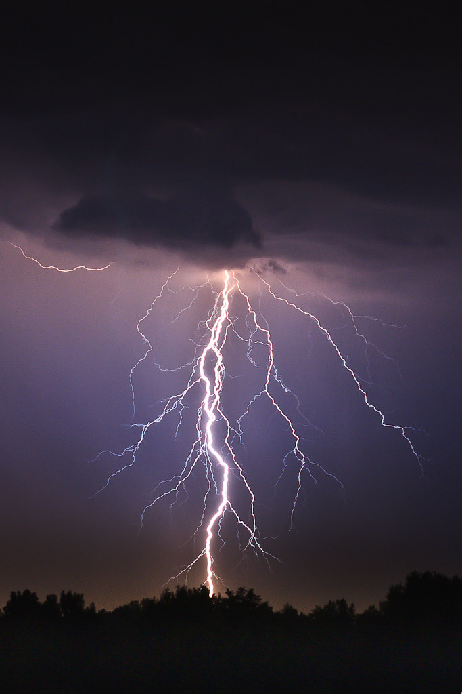
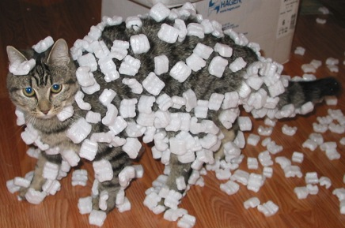
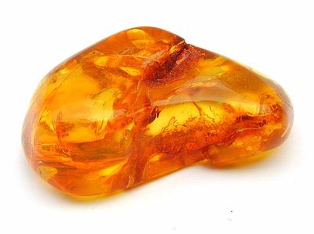
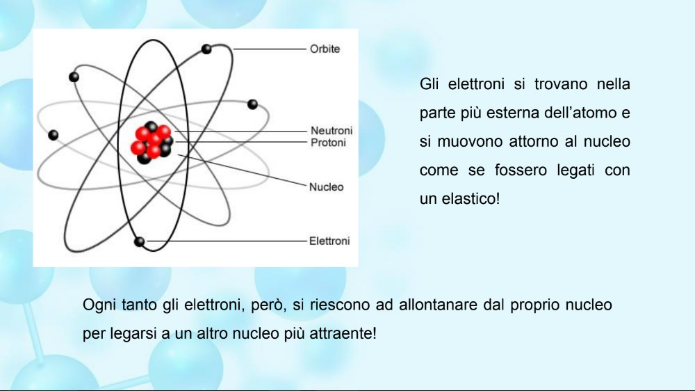

[comment]: # (This presentation was made with markdown-slides)
[comment]: # (This is a CommonMark compliant comment. It will not be included in the presentation.)
[comment]: # (Compile this presentation with the command below)
[comment]: # (mdslides elettronica_micropython.md --include media)

[comment]: # (THEME = league)
[comment]: # (CODE_THEME = base16/zenburn)
[comment]: # (controls: true)
[comment]: # (keyboard: true)
[comment]: # (markdown: { smartypants: true })
[comment]: # (hash: false)
[comment]: # (respondToHashChanges: false)
[comment]: # (slideNumber: true)

<style>
.reveal h1 { font-size: 2.5em; }
</style>

## Elettronica con Micropython
 <!-- .element: style="height:250px; max-width:200vw; image-rendering: crisp-edges;" -->

Pascal Brunot | AISTAP | July 2023

Note:
- Electricity concepts
- The idea of electricity involving a ‘flow’ (of … something… see 3!)
- The idea of a ‘complete circuit’ being necessary for the flow to occur (in a battery-powered circuit)
- The idea of charge (what flows in circuits)
- The idea of current (the rate of flow of charge)
- The idea of potential difference (the cause of the flow – ideas about how PD links to transferred energy)
- The idea of resistance (a measure of the ‘opposition’ to the flow of charge)

[comment]: # (!!!)

## Introduzione

Perché queste due parole assieme ? Cosa possono fare ?

<iframe width="560" height="315" src="https://www.youtube.com/embed/aXW4dqvjFx0" title="YouTube video player" frameborder="0" allow="accelerometer; autoplay; clipboard-write; encrypted-media; gyroscope; picture-in-picture; web-share" allowfullscreen></iframe>

[comment]: # (!!!)
## Introduzione

1. Per programmare questi robot ci vuole ... Micropython
2. Per capire i componenti elettronica ci vuole... un po' di fisica
3. Inizieremo a capire l'elettricità nelle prossime lezioni

Note:
- Chiarire che non costruiremo un robot

[comment]: # (!!!)


## Lezione 1
Elettricità

Note:
- Materiali richiesti: palloni. pezzi di carta tagliati, piatto, corda 5-10m un po spessa


[comment]: # (!!!)

## Importanza dell’elettricità 1/2

- E' importante l'ettricità?


Note:
- Avete già avuto un black out a casa? Come vi siete sentiti ?
- Chiedere a cosa serve l'elettricità?
- Acqua potabile (pompe), Forno elettrico, luce, conservazione del cibo

[comment]: # (!!! data-auto-animate)

## Importanza dell’elettricità 2/2

- "Motore" della società moderna

Note:
- Menzionare idrocarburi come secondo "motore"

---

E' sempre stato così?
Perché è così comoda?

Note:
- Cosa usavamo prima ? carbone, legna.
- Non inquina ed è facile da trasportare

[comment]: # (!!! data-auto-animate)

## Elettricità nel mondo 1/2

- Elettricità nel mondo - tanta o poca?

---


3000 TWh = 3.000.000.000.000.000 Watt-ora

Ce ne vorrà di più in futuro ?

[comment]: # (!!! data-auto-animate)
## Elettricità nel mondo 2/2

- Elettrificazione come motore della riduzione CO2

Note:
- Esempio delle macchine
- Graduale sostituzione fossili con altre forme di energia e elettricità
- Chiedere se l'hanno mai vista?

[comment]: # (!!! data-auto-animate)

## L'elettricità visibile 1/2

- In natura?...

---

 <!-- .element: style="height:400px; max-width:200vw; image-rendering: crisp-edges;" -->

Scarica di elettricità fra la nuvola e il suolo

[comment]: # (!!! data-auto-animate)

## L'elettricità visibile 2/2

- Elettricità statica



Cosa trattiene il polistirolo al gatto ?

Note:
- Dato che non si vede spesso, si sono voluti due milleni per iniziare a capirla. Noi abbiamo 4 ore
- Elettricità come flusso di qualcosa

[comment]: # (!!!)

## Esperimento con palloni

- A gruppi di due bambini, uno strofina il pallone sulla maglietta dell'altro

- Cosa succede al pallone ? 
- Cosa succede ai vostri cappelli ?

---

- [Spiegazione](https://phet.colorado.edu/sims/html/balloons-and-static-electricity/latest/balloons-and-static-electricity_en.html)
- Il movimento "carica" positivamente il pallone e "negativamente" la maglietta
- (???) Conservazione della carica elettrica

Note:
- Spiegazione cariche

---
- Pallone con pezzi di carta

Note:
- https://www.stem.org.uk/resources/elibrary/resource/27020/electric-sausage
- Forza elettrostatica (Legge di Coulomb)

[comment]: # (!!!)

### Definizione elettricità

- Il nome provviene dalla parola greca per l'ambra gialla in Greco



- Ricordate l'atomo ? Com'è fatto ?

Note:
- Primo studioso dell'ettricità Talete (600 a.C) - lo stesso del teorema
- 
---

### Definizione elettricità

 <!-- .element: style="height:250px; max-width:200vw; image-rendering: crisp-edges;" -->

Cosa è carico elettricamente in questa immagine?

Note:
- Importante sottolineare che tutta la materia è fatta da atomi
- Ci sono particelle cariche in ogni atomo
- Le cariche elettriche sono dapertutto, non solo nell'elettricità

[comment]: # (!!! data-auto-animate)

### Definizione elettricità

- Definizione classica come movimento di cariche (elettroni)
- Direzione
- Movimento + -
- Ma ...elettricità scoperta prima degli elettroni… vanno in senso diversi
-- Scoperta come raggi catodici (immagine visibile degli elettroni)

Note:
- Si userà la convenzione usuale nel corso
- Domande di verifica: cariche positive/negative, atomo

[comment]: # (!!!)
### Conduttori e isolanti
- Teoria: Facilità a strappare elettroni
- Materie diverse ma sono gli stessi elettroni (rimando corso chimica)
- Verifica esperimentale con un tester di continuità e vari materiali, chi conduce bene e chi
no (insegnante) (Eventualmente acqua / acqua salata e link con ioni di chimica)

[comment]: # (!!!)
### Misura dell’elettricità
- Analogia della cascata (altezza = potenziale V, debito = corrente)
- Oppure analogia della corda ? corrente = movimento della corda. Resistenza un alunno.
- Le unità (Volt- Volta, Ampère)
- Generatore di tensione ideale e pila

Note:
- La corda evita l'errore di pensare che le cariche vengono dalle batterie, sono già presenti
- Conservazione della carica <-> conservazione della corda che entra/esce, non si "consuma" la carica
- Movimento delle cariche simultaneo della corda
- Analogia della resistenza che scalda la mano ma non degli altri
- Non è un bel modello per spiegare la tensione però

[comment]: # (!!!)
### Il multimetro
- Come misurare la tensione (uso del multimetro, accensione, V, + e -)

[comment]: # (!!!)
### Esperimento

- Misurare tensione di una pila (generatore di tensione)
- Domanda aperta : cosa succede se metto due pile in serie? In parallelo?
- Ipotesi di classe
- Esperimenti a gruppo e raccolte misure
- Conclusione: generatori di tensioni in serie producono una tensione = somma. In // la
tensione rimane la stessa.
- Terminologia: 
>circuito aperto/chiuso

[comment]: # (!!!)
### Effetti dell’elettricità (slide finale)
- Produce calore, luce (lampadine)
- Movimento (motori)
- Rischi (pericolo tensioni sul corpo umano)

[comment]: # (!!!)

## Lezione 2

### Motori DC, resistenze, schemi elettrici

[comment]: # (!!!)

Riprendere tema effetti elettricità Sessione I
Motore DC (Elettricità e magnetismo)
Inizio con domanda/quesito : scopriamo un effetto nascosto dell’elettricità !

come ? costruzione motore homopolo per illustrare collegamento con magnetismo

Osservazioni dei vari gruppi sotto la guida dell’insegnante

[comment]: # (!!!)
Sfida alla classe: perché gira ?
Formulazione ipotesi della classe
(il magnete attrae/repelle)
(ma perché solo con la pila?)
(osservazione senso di rotazione della bobina)

Test ipotesi:

Togliere magnete, usare bobina isolata
Cambio verso della pila ? (POLO ELETTRICO) – cambia senso
Cambio verso del magnete? (POLO MAGNETICO) – cambia senso

[comment]: # (!!!)
Spiegazione (slide): la corrente circolando nella bobina crea un "magnete" che viene attratto o rimando dal magnete fisso e questo fa girare la bobina.

Ma perché non rimangono i magneti all’equilibrio e va avanti a girare ?
Trucco del filo conduttore solo a metà (si interrompe il magnete dopo mezzo giro per evitare questo)

[comment]: # (!!!)
Resistenze (2 slides)
Simbolo elettrico e unità di misura
Fanno "resistenza" - Rallentano il flusso e si riscaldano
>Legge di Ohm = Tensione = Corrente x Resistenza
Misura delle resistenze con il multimetro

[comment]: # (!!!)
Schede di connessione senza fili (come funzionano) (1 slide)
Collegamento verticale vs. orizzontali

Esperimento 
Sfida : Cosa succede se ne metto una dopo l’altra ? Una sopra l’altra? 

Ipotesi della classe
Misuriamo 

Mettere 2 resistenze uguali in serie
Mettere 2 resistenze uguali in parallelo

Misure resistenze (di valori uguali possibilmente così abbiamo come risultato 2R ; 0.5R)
 valore ottenuto, R1//R2=(R1+R2)/(R1*R2)

[comment]: # (!!!)
Cenni su altri componenti (3 slides)

Interruttori e simboli
Bobina (induttore) e simbolo come "serbatoio di corrente" (in senso inverso...)
Condensatori e simbolo come "serbatoio di tensione"

[comment]: # (!!!)
Conclusione : leggiamo uno schema elettrico assieme
Riconoscere i simboli
Seguire la corrente
Qualche simbolo misterioso per la prossima lezione

[comment]: # (!!!)


```python [1-2|3|4]
a = 1
b = 2
c = x => 1 + 2 + x
c(3)
```
[comment]: # (!!!)

## Imaggine

[comment]: # (!!!)

## Fonti usate in questa presentazione

### STEM
### Python
### AISTAP Chimica Dott. Carlini
### Sparkfun Creative commons
- https://learn.sparkfun.com/tutorials/what-is-electricity/all
### Images
- "Ka-boom (lightning)" by Leszek.Leszczynski is licensed under CC BY 2.0.
### Others
- IEA, Global electricity demand by region in the Stated Policies Scenario, 2000-2040, IEA, Paris https://www.iea.org/data-and-statistics/charts/global-electricity-demand-by-region-in-the-stated-policies-scenario-2000-2040, IEA. Licence: CC BY 4.0