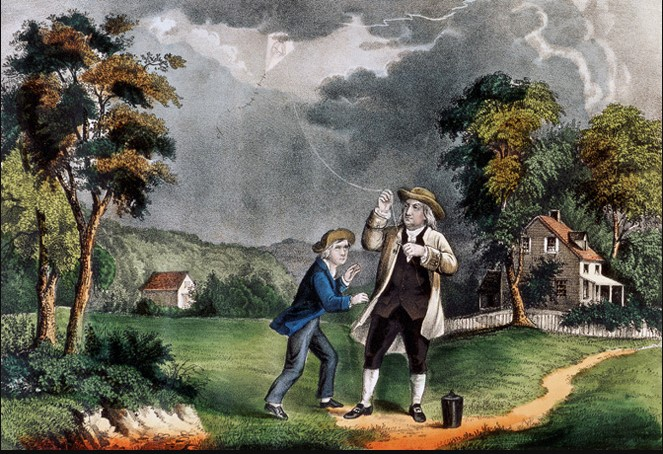
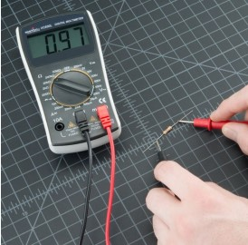

[comment]: # (THEME = league)
[comment]: # (CODE_THEME = base16/zenburn)
[comment]: # (controls: true)
[comment]: # (keyboard: true)
[comment]: # (markdown: { smartypants: true })
[comment]: # (hash: false)
[comment]: # (respondToHashChanges: false)
[comment]: # (slideNumber: true)


<style>
.reveal h1 { font-size: 2.5em; }
</style>
<style type="text/css">
    :root {
        --r-main-font-size: 32px;
    }
</style>
<style type="text/css">
.twocolumn {
   display: grid;
   grid-template-columns: 1fr 1fr;
   grid-gap: 10px;
   text-align: left;
}
</style>

[comment]: # (!!!)

## Elettronica con Micropython
 <!-- .element: style="height:250px; max-width:200vw; image-rendering: crisp-edges;" -->

Pascal Brunot | AISTAP | Luglio 2023

Lezione 1 : Elettricità

Note:
- Obiettivi della lezione
- Capire il concetto di carica (con elettricità statica)
- L'elettricità come un flusso di cariche
- Distinguere conduttori e isolanti
- Necessità di un circuito chiuso per il flusso (corda)
- Definizioni e unità di corrente, tensione, resistenza
- Approccio scientifico (ipotesi, esperimento, risultati, conclusioni)
- Imparare a fare misura di tensione con il multimetro

[comment]: # (!!!)

## Introduzione

Perché queste due parole assieme ? Cosa possono fare ?

<iframe width="560" height="315" src="https://www.youtube.com/embed/aXW4dqvjFx0" title="YouTube video player" frameborder="0" allow="accelerometer; autoplay; clipboard-write; encrypted-media; gyroscope; picture-in-picture; web-share" allowfullscreen></iframe>

[comment]: # (!!!)
## Introduzione

1. Per programmare questi robot ci vuole ... Micropython
2. Per capire i componenti elettronica ci vuole... un po' di fisica
3. Inizieremo a capire l'elettricità nelle prossime lezioni

Note:
- Chiarire che non costruiremo un robot ma qualcos'altro

[comment]: # (!!!)


## Lezione 1

Elettricità


Note:
- Oggi sarà la lezione più teorica di tutte perché dobbiamo imparare i concetti ma ci divertiremo anche facendo esperimenti
- Materiali richiesti: palloni, pezzi di carta tagliati, piatto, corda 5-10m un po spessa
- Pile elettriche 1.5 V (2 a bambino), fili, alluminio, scotch
- Acqua / Acqua salata, monetine, ferro
- Alcuni multimetri

[comment]: # (!!!)

## Importanza dell’elettricità 1/3

E' importante l'ettricità oggi ?

Vediamo senza


Note:
- Avete già avuto un black out a casa? Come vi siete sentiti ?
- Chiedere a cosa serve l'elettricità?
- Acqua potabile (pompe), Forno elettrico, luce, conservazione del cibo

[comment]: # (!!!)

## Importanza dell’elettricità 2/3

"Motore" della società moderna

_E per gli esseri viventi ?_

Note:
- Avere più energia a disposizione ha consentito alla popolazione umana di vivere in grandi città
- Menzionare idrocarburi come secondo "motore"
- Nervi
- Sapete come è stato scoperto ? Scienfico italiano, Galvani e le rane

[comment]: # (!!!)

## Importanza dell’elettricità 3/3

E' sempre stato così importante nella nostra vita?

Note:
- Cosa usavamo prima ? carbone, legna, animali

[comment]: # (!!! data-auto-animate)

## Importanza dell’elettricità 3/3

E' sempre stato così importante nella nostra vita?


Nota:
- Adesso cosa si usa al posto degli animali ?
- Siamo diventati meno contadini e più urbani in poche decenni

[comment]: # (!!!)

## Importanza dell’elettricità 3/3

_Ma perché è così comoda l'elettricità?_

_Da dove proviene l'elettricità che abbiamo in casa ?_

Note:
- Non inquina ed è facile da trasportare
- "Vettore energetico"
- Centrali elettriche (idroelettriche, termiche gas/carbone, eolico, solare, ...)
- La generazione può essere pulita spesso non lo è

[comment]: # (!!!)

## Elettricità nel mondo 1/3

- Elettricità nel mondo - tanta o poca?

---


3000 TWh = 3.000.000.000.000.000 Watt-ora

Ce ne vorrà di più in futuro ?

Note:
- Un asciugacapelli di 2000 W accesso un'ora quanto consuma?
- Accesso due ore? (1 anno=17.5MWh)
- 3000 TWh sono 171 millioni di acciugacappelli accessi in permanenza

[comment]: # (!!! data-auto-animate)

## Elettricità nel mondo 2/3

Elettrificazione come motore della riduzione CO2


Note:
- Dicembre 1952, 4000 morti, 100000 malati per via dello smog (carbone)
- Esempio delle macchine elettriche vs. a combustione
- Graduale sostituzione fossili con altre forme di energia e elettricità
- La combustione dei carburanti fossili producono CO2 nell'atmosfera che assorbe il calore (infrarossi) emesso dal suolo
- 2400 GT dalla fine della seconda guerra mondiale... ne possiamo emettere 1200 GT max per stare <2.5°C

[comment]: # (!!! data-auto-animate)

## Elettricità nel mondo 3/3

Elettronica sempra più potente e presente


Note:
- Chiedere se l'hanno mai vista l'elettricità ?
- E' ora di guardarci da vicino

[comment]: # (!!! data-auto-animate)

## L'elettricità visibile 1/2

- In natura?...

---

 <!-- .element: style="height:400px; max-width:200vw; image-rendering: crisp-edges;" -->

Scarica di elettricità fra la nuvola e il suolo

Note:
- Elettricità "scorre" come un fluido
- C'è l'elettricità anche negli esseri viventi (impulsi nervosi, Galvani)

[comment]: # (!!! data-auto-animate)

## L'elettricità visibile 2/2

- Elettricità statica


Cosa è successo in questa immagine ?
Cosa trattiene il polistirolo al gatto ?

Note:
- "ELETTRICITA' STATICA" è la parola
- Dato che non si vede spesso, si sono voluti due milleni per iniziare a capirla. Noi abbiamo 5 lezioni

[comment]: # (!!!)

## Esperimento con palloni

A gruppi di due bambini, uno strofina il pallone sulla maglietta dell'altro

- Cosa succede al pallone ? 
- Cosa succede ai vostri cappelli ?
- E fra due palloni ?

---

[Spiegazione](https://phet.colorado.edu/sims/html/balloons-and-static-electricity/latest/balloons-and-static-electricity_en.html)

- Il movimento "carica" positivamente il pallone e "negativamente" la maglietta
- Le cariche uguali si rispongono, le cariche opposte si attragono

Note:
- Spiegazione cariche 
- Forza elettrostatica (Legge di Coulomb)

---
## Una carica può crearne un'altra

- Pallone con pezzi di carta


Note:
- Induzione elettrostatica
- https://www.stem.org.uk/resources/elibrary/resource/27020/electric-sausage

[comment]: # (!!!)

### Definizione elettricità

Il nome provviene dalla parola greca per l'*ambra gialla* in Greco


- Ricordate l'atomo ? Com'è fatto ?

Note:
- Primo studioso dell'ettricità Talete (600 a.C) - lo stesso del teorema
- Avevano visto che come il pallone l'ambra strofinata attraeva piccoli oggetti

---

### Definizione elettricità

 <!-- .element: style="height:250px; max-width:200vw; image-rendering: crisp-edges;" -->

Quali parti sono cariche elettricamente in questa immagine?

Note:
- Importante sottolineare che tutta la materia è fatta da atomi
- Ci sono particelle cariche in ogni atomo
- Le cariche elettriche sono dapertutto, non solo nell'elettricità

[comment]: # (!!! data-auto-animate)

### Definizione elettricità 1/3

Dobbiamo fare un po' di storia

"Fluido elettrico" di Benjamin Franklin (1757)

- Capì che esistevano cariche diverse (+ e -)
- Decise lui che la corrente va dal + al -

---

Benjamin Frankin è famoso per l'invenzione del parafulmine (1752)



Note:
- Nel quadro sopra, Franklin voleva dimostrare che le nuvole sono cariche come i nostri palloni
- Il filo dell'acquilone era un filo elettrico e Franklin sperava di scaricare la nuvola
- Riuscì a osservare scariche elettriche all'estremità del filo

[comment]: # (!!! data-auto-animate)


_Non è famoso per rispettare la sicurezza dei bambini_

Note:
- Se il fulmine avesse colpito il loro acquilone loro sarebbero stati uccisi
- Parafulmine faceva paura alle popolazioni, attraeva la colera di Dio 
- Si sarebbero evitati 3000 morti a Brescia quando un fulmine colpì la polveriera nel 1769

[comment]: # (!!! data-auto-animate)

### Definizione elettricità 2/3

Tutti pensavano allora che l'elettricità fosse una specie di liquido invisible

- Scoperta dell'elettrone grazie ai "raggi catodici" (Thomson, 1897)

<iframe width="560" height="315" src="https://www.youtube.com/embed/8Q5QuXh2XH0" title="YouTube video player" frameborder="0" allow="accelerometer; autoplay; clipboard-write; encrypted-media; gyroscope; picture-in-picture; web-share" allowfullscreen></iframe>

---

Allora si capì che l'elettricità erano delle cariche in movimento


Note:
- Perché non si muovono i protoni invece? 10.000 volte più pesanti degli elettroni.

[comment]: # (!!! data-auto-animate)

### Definizione elettricità 3/3

Elettricità 
: cariche in movimento

Ma movimento in quale direzione ?

- Senso convenzionale della corrente in un circuito (Franklin)

<iframe src="media/conventional-current.mp4" frameborder="0" allow="accelerometer; autoplay; clipboard-write; encrypted-media; gyroscope; picture-in-picture" allowfullscreen></iframe>


Note:
- Si userà la convenzione usuale nel corso
- Domande di verifica: cariche positive/negative, atomo

[comment]: # (!!!)

### Esercizio di classe

1. Tutti i bambini tengono la corda senza stringerla
2. Un bambino stringe leggermente la corda
3. L'insegnante inizia a fare scorrere la corda fra le sue mani


Note:
- E' solo un'analogia della corrente, non è perfetto (ad es. la tensione è problematica)
- Conservazione della carica <-> conservazione della corda che entra/esce, non si "consuma" la carica
- Movimento delle cariche simultaneo della corda
- Analogia della resistenza che scalda la mano ma non degli altri
- La corda evita l'errore di pensare che le cariche vengono dalle batterie, sono già presenti

[comment]: # (!!!)

### Conduttori e isolanti #1

Tutti i materiali fanno passare le cariche?


Prova con tester di continuità + vari materiali

Note:
- Chi conduce bene l'elettricità? Metalli
- I buoni conduttori hanno elettroni liberi di spostarsi
- I bimbi portanno i materiali da testare all'istruttore con il tester

[comment]: # (!!!)

### Conduttori e isolanti #2

Usiamo un simulatore per vedere:

[JavaLab](https://javalab.org/en/electric_current_en/)

- Alcuni atomi "si tengono stetti" i loro elettroni (isolanti)
- Altri li possono prestare (conduttori)

[comment]: # (!!!)

### Misura dell’elettricità

Tante unità diverse per l'elettricità
- L'unità di Alessandro Volta (inventore della pila)
- L'unità di André-Marie Ampère 
- L'unità di Georg Ohm
- e molte altre (Watt, Farad, Henry, Coulomb)...

---

Secondo voi chi se l'è passata meglio fra i tre?

[comment]: # (!!! data-auto-animate)
Volta divenne senatore e ebbe la sua villa a Como


[comment]: # (!!! data-auto-animate)
Ampère ha il suo nome inciso nella Torre Eiffel


[comment]: # (!!! data-auto-animate)
Ohm non fu creduto e rinuncio al posto in università


[comment]: # (!!!)

### Misura dell’elettricità

Ricordiamo 3 grandezze

| Grandezza (Abbr.) | Unità | Simbolo | Spiegazione |
| -- | -- | -- | -- |
| *Corrente* (I) | Ampere | A | Flusso delle cariche elettriche |
| *Tensione* (U o V) | Volt   | V | Potenziale delle cariche elettriche |
| *Resistenza* (R) | Ohm | Ω | "Freno" alle cariche elettriche |
 
Note:
- I simboli delle unità che provvengono da un personaggio storico sono in maiuscole (A non a)
- Non si usano gli accenti nelle unità (Ampère->Ampere)
- Alle unità si possono aggiungere i soliti prefissi come per le lunghezze (milli-m, chilo-k, mega-M)
- Domande : che corrente fa 100 mA + 1 A in A ?
- Domande : che tensione c'è fra 1 kV - 500 V in V ?

[comment]: # (!!!)

### Il multimetro


Com'è fatto? Come si accende ? Colori dei fili ?

Note:
- Come si misura una tensione ? Simbolo V DC
- La tensione si misura fra due punti del circuito
- La tensione si misura "IN PARALLELO" ai due punti
- Accendete e mettelo su misura di tensione

[comment]: # (!!!)

### Esperimento : misurare tensioni

- Misurare tensione di una pila
- Di due pile
- Disposte in modo diverso

[TinkerCad](https://www.tinkercad.com/things/kFyHZJa3gyv)

- Ipotesi di classe : cambierà qualcosa?

[comment]: # (!!!)

### Risultati esperimento

| Configurazione | Valore misurato | Conclusione |
| -- | -- | -- |
| 1 Pila | ??? | ??? |
| Pile una dopo l'altra (serie) | ??? | ??? |
| Pile connesse in parallelo (//) | ??? | ??? |
| Pile che non si toccano | ??? | ??? |

Note:
- Obiettivo è che tutti i bambini sappiano misurare una tensione
- Raccolta valori
- Generatori di tensione in serie si sommano
- In parallelo, non si sommano (quando hanno la stessa tensione)

[comment]: # (!!!)

### Rappresentazione schematica

Le pile sono generatori di tensione


Esistono due simboli


[comment]: # (!!!)

### Effetti dell’elettricità

- Produce calore, luce (lampadine)
- Movimento (motori)
- Rischi (pericolo tensioni sul corpo umano)


Note:
- Insistere che non si gioca con l'elettricità 

[comment]: # (!!!)

### Riassunto finale

Elettricità
: cariche in movimento

Conduttori e isolanti

Unità di misura
- Ampere per il flusso di cariche
- Volt per il potenziale elettrico
- Ohm per la resistenza al flusso di cariche

Note:
- se c'è tempo elettrolisi acqua salata


[comment]: # (!!!)

### Prossima lezione

Chi deve installare Thonny e il driver sul proprio computer?

Note:
- Verificare che siano tutti più o meno pronti con Thonny per la prossima lezione
- Per la lezione 2 non serve la connessione alla board

.twocolumn {
   display: grid;
   grid-template-columns: 1fr 1fr;
   grid-gap: 10px;
   text-align: left;
}
</style>

[comment]: # (!!!)

## Elettronica con Micropython
 <!-- .element: style="height:250px; max-width:200vw; image-rendering: crisp-edges;" -->

Pascal Brunot | AISTAP | Luglio 2023

Lezione 2 : Motori, Resistenze e Python

Note:
- Obiettivi della lezione
- Collegamento elettricità - magnetismo
- Motore DC
- Approccio scientifico (osservazione-ipotesi-esperimento-conclusioni)
- Legge di Ohm
- Misurare resistenze
- Resistenze in parallelo e in serie

[comment]: # (!!!)

## Riassunto ultima lezione 1 / 2

Elettricità è *movimento di cariche elettriche*

Note:
- Abbiamo visto che l'elettricità è fondamentale nel mondo
- Abbiamo fatto circolare la corda fra le mani come l'elettricità nei conduttori
- Esistono conduttori e isolanti
- Abbiamo conosciuto alcuni scienzati famosi che hanno dato il loro nome a certe unità

[comment]: # (!!!)

## Riassunto ultima lezione

*Unità di misura*

| Grandezza (Abbr.) | Unità | Simbolo | Spiegazione |
| -- | -- | -- | -- |
| *Corrente* (I) | Ampère | A | Flusso delle cariche elettriche |
| *Tensione* (U o V) | Volt   | V | Potenziale delle cariche elettriche |
| *Resistenza* (R) | Ohm | Ω | "Freno" alle cariche elettriche |

[comment]: # (!!!)

## Riassunto ultima lezione

Abbiamo usato alcuni componenti elettrici...

- Pile (generatori di tensione)
- Fili
- Multimetro

[comment]: # (!!!)

## Magneti


Cosa vedete su questa immagine ?
Prendete due magneti e provate a avvicinarli/allontanarli
- Che cosa osservate ?

Note:
- Cosa hanno i magneti ? (poli N e poli S)
- C'è però una differenza fondamentale con l'elettricità - non esistono monopoli magnetici
- Abbiamo visto invece che esistono cariche elettriche isolate (palloni)

[comment]: # (!!!)

### La scoperta di Ørsted

Bussola e corrente elettrica (1820)

<iframe width="560" height="315" src="https://www.youtube.com/embed/h5N2grjG8d8" title="YouTube video player" frameborder="0" allow="accelerometer; autoplay; clipboard-write; encrypted-media; gyroscope; picture-in-picture; web-share" allowfullscreen></iframe>

Magnetismo e elettricità sono legati

Si parla spesso di "elettromagnetismo"

Note:
- (Valutare se fare esperimento con batteria di macchina)
- L'elettricità era già nota e studiata da un secolo prima che si notasse questo effetto
- Maxwell nel 1864 scrisse le leggi che unificano elettricità e magnetismo
- vediamo come fare qualcosa di utile con tutti i due

[comment]: # (!!!)

### Hans Christian Ørsted


_secondo voi per lui com'è andata la vita?_

Note:
- Dopo l'elettromagnetismo è stato il primo chimico a produrre alluminio 
- Il suo nome è stato dato ad un asteroide

[comment]: # (!!!)

### Uniamo elettricità e magnetismo

Oggi anche noi faremo esperimenti

Costruiamo un motore elettrico

Il simbolo del motore


Note:
- Adesso scopriamo anche noi questo effetto nascosto

[comment]: # (!!!)

### Costruzione motore

Istruzioni
- Mettere le due graffette sulle connessioni laterali della breadboard
- Disporre bobina in mezzo alle graffette
- Collegare le 3 batterie alle connessioni
- Dare un piccolo impulso alla bobina
- Avvicinare con la mano i magneti

Note:
- motore homopolo 
- quanto tutti hanno un motore funzionante passare alle domande

[comment]: # (!!!)

### Osservazione

Girano tutte nello stesso verso ?

Perché girano secondo voi ?


[comment]: # (!!!)

### Ipotesi

| Chi | Come gira | Perché gira ? |
| -- | -- | -- |
| Gruppo 1 | $$ \hookleftarrow \hookrightarrow ? $$ | ...... |
| Gruppo 2 | ..... | .... |
| Gruppo 3 | ..... | .... |
| Gruppo 4 | ..... | .... |
| Gruppo 5 | ..... | .... |
| Gruppo 6 | ..... | .... |

Provate a farlo girare nell'altro senso ?

[comment]: # (!!!)

## Ipotesi 

Da cosa dipende il senso di rotazione ?

Osserviamo

<iframe width="560" height="315" src="media/motore.mp4" title="Video player" frameborder="0" allow="accelerometer; autoplay; clipboard-write; encrypted-media; gyroscope; picture-in-picture; web-share" allowfullscreen></iframe>

Note:
- "è l'elettricità" che lo fa girare ? -> allora togliamo il magnete
- "senso di rotazione diversi" -> cambiamo verso del magnete 
- provare a cambiare il + e il - della pila
- ricordare effetto di Orsted

[comment]: # (!!!)

### Conclusioni scientifiche

Le cariche elettriche in movimento nella bobina creano un "magnete" che viene attratto o respinto dal magnete fisso

Questa spinta fa girare la bobina.
- esattamente come l'ago della bussola si spostava con la corrente
- però la bussola poi si fermava... perché questo no?

Note:
- Non è affatto semplice spiegare che il campo magnetico del magnete fisso attrae metà bobina e respinge metà bobina creando il movimento 
- Spiegare la regola della mano sinistra mi sembra troppo ambizioso

[comment]: # (!!!)

### Conclusioni scientifiche

Perché non rimangono i magneti in equilibrio (e invece va avanti a girare) ?

La parte di filo in contatto con la graffetta è conduttrice *solo a metà* 

Ad ogni mezza-rotazione si interrompe la corrente *ma la bobina continua per inerzia*

Note:
- Trovare animazioni?
- Valutare se fare l'esperimento con multimetro e bobina in rotazione per osservare generazione
- Legge di Faraday $$ {\mathcal {E}}=-{\frac {\mathrm {d} \Phi _{B}}{\mathrm {d} t}} $$

[comment]: # (!!!)

### Resistenze 1/3

Ogni componente ha un simbolo

Ecco la resistenza


Note:
- Fanno "resistenza" - Rallentano il flusso delle cariche
- Ciò facendo prendono si riscaldano prendendo l'energia 
- Cosa succedeva alla mano che stringeva la corda? si riscaldava
- Si riscaldono le resistenze? Resistenza del forno, della lavatrice...

---

Resistenza del forno


Note:
- Attenzione che la RESISTENZA ELETTRICA c'è dapertutto (salvo superconduttori)
- Potremmo dire che un conduttore ha una resistenza ... (bassa)
- E un isolante ha una resistenza ... (alta)

---

Resistenze usate in elettronica


Note:
- Commentare resistenze che hanno i ragazzi
- Resistenze che variano con la temperature (termistori)
- Resistenze aggiustabili con un bottone (potenziometri, reostati)
- Piccole resistenze saldate in superficie
- Noi useremo le resistenze a film di carbone per montaggio con foro passante
- Menzionare che esiste un codice di colore sulle resistenze per capirne il valore

[comment]: # (!!!)

### Misura delle resistenze con il multimetro

Le resistenze si misurano con il multimetro in posizione Ω



-> Misurate le resistenze che avete sul tavolo

Note:
- Come le tensioni le resistenze di misurano fra due punti del circuito con il multimetro in parallelo

[comment]: # (!!!)

### Misura delle resistenze con il multimetro

| Chi | Valore |
| -- | -- |
| Gruppo 1 | ..... Ω |
| Gruppo 2 | ..... Ω |
| Gruppo 3 | ..... Ω |
| Gruppo 4 | ..... Ω | 
| Gruppo 5 | ..... Ω |
| Gruppo 6 | ..... Ω |

[comment]: # (!!!)

### Breadboard 1/2

_Breadboard_ = scheda di connessione senza fili

Servono a creare circuiti semplici

Le righe verticali servono per collegare le alimentazioni (pile)

Le righe orizzontali servono per collegare i componenti 


Note:
- I fori di una riga della breadboard sono internamente collegati fra loro mediante una barretta metallica
- non si deve forzare l'inserimento nei fori delle zampe dei componenti 
- non si devono inserire nei fori conduttori con le estremità piegate, ma occorre raddrizzarle prima servendosi di una pinza
- i fili devono passare attorno, non sopra i componenti

[comment]: # (!!!)

### Breadboard configurazione 1

[comment]: # (!!!)

### Breadboard configurazione 2

[comment]: # (!!!)

### Breadboard configurazione 3

[comment]: # (!!!)

### Fate il vostro primo circuito

Mettere 2 resistenze uguali una dopo l'altra
Mettere 2 resistenze uguali accanto l'uno l'altra
Misurate la resistenza totale 

[TinkerCad](https://www.tinkercad.com/things/8aVDNguOsCs)


Note:
- [Circuito](https://www.tinkercad.com/things/8aVDNguOsCs-sizzling-borwo/editel)
- Accanto = parallelo
- Dopo = Serie
- Fili = ricordatevi la corda che deve circolare

[comment]: # (!!!)

### Risultati

| Gruppo | Valore singola resistenza | Valore in serie | Valore in parallelo |
| -- | -- | -- | -- |
| 1 | ..... Ω | ..... Ω |..... Ω |
| 2 | ..... Ω | ..... Ω |..... Ω |
| 3 | ..... Ω | ..... Ω |..... Ω |
| 4 | ..... Ω |  ..... Ω |..... Ω |
| 5 | ..... Ω | ..... Ω |..... Ω |
| 6 | ..... Ω | ..... Ω |..... Ω |

Note:
- Cosa possiamo concludere?

[comment]: # (!!!)

### Python 1


Note:
- Chi ha già scritto programmi ?
- Chi ha già fatto un corso di Python ?
- Conoscete altri linguaggi di programmazione ?

### Python

Lanciare Thonny

---

REPL = _Read, Print, Eval, Loop_


Esegue subito un commando

---

Nel REPL scrivete le istruzioni dopo >>> e fate INVIO

```python [1|2|3|4]
>>> 1+1
2
>>> 3*10**15
3000000000000000
```

Python è un ottimo calcolatore

---

Adesso passiamo alla parte programma

```python
print("Sono un programma in Python")
```

Clic sul triangolo bianco nel cerchio verde

Note:
- Aspettare che tutti abbiano eseguito il programma

---

Ripasso variabili, funzioni

```python [1-2]
nome = input("Come ti chiami ?")
print ("Ciao " + nome)
```

Note:
- Verificare che tutti abbiano scritto il programma

---

Funzioni utili

```python [1-4]
print
input
type
str, int
```

Paroli chiavi
- def, return
- for, while

Note:
- Valutare cheatsheet per sintassi Python

[comment]: # (!!!)

### Pausa Python 2/4

Facciamo la formula delle resistenze in serie

$$ R_{serie} = R_{1} + R_{2} $$

```python [1-2|3-4]
def serie(r1, r2):
    return r1 + r2

print(serie(100, 100))
```

[comment]: # (!!!)

### Pausa Python 3/4

Facciamo la formula delle resistenze in parallelo

$$ R_{parallelo} = \frac{R_{1} \times R_{2}}{R_{1} + R_{2}} $$

```python [1-2|3-4]
def parallelo(r1, r2):
    return (r1 * r2)/(r1 + r2)

print(parallelo(100, 200))
```

Verificate se ritrovate il valore misurato in parallelo prima

Note:
- Risultato atteso 100//200= 66.66 Ω
- Con due resistenze in parallelo la resistenza equivalente è sempre *più piccola* di entrambe resistenze

[comment]: # (!!!)

### Legge di Ohm 1/2

Le cariche elettriche che passano attraverso una resistenza seguono la *legge di Ohm*

$$ U = R \times I $$

Tensione = Corrente x Resistenza

Note:
- Spiegare il concetto di legge fisica ? 
- Sarà l'unica formula che vedremo durante il corso ma è la più importante
- Si possono manipolare i termini dell'equazione U/R=I, I=U/R

[comment]: # (!!!)

### Legge di Ohm 2/2

Un triangolo per ricordare la legge di Ohm


_V era il simbolo della tensione, come U, ricordate?_

[comment]: # (!!!)

### Pausa Python 3/3

Adesso facciamo la legge di Ohm in Python

$$ U = R . I $$

```python [1-2|3-4]
def ohm_u(r, i):
    return r * i

print(ohm_u(200, 0.1))
```

Risultato con R=200 Ω, I=0.1A ?

Note:
- Risultato 20 V
- Esercizi extra possibili

[comment]: # (!!!)

### Altri componenti

- Interruttori

[comment]: # (!!!)

### Induttori

Bobina (induttore), sono "serbatoio di corrente" (contrari)


Simbolo


[comment]: # (!!!)

### Condensatori

Condensatori, sono "serbatoio di tensione"

Simbolo


[comment]: # (!!!)

### Schema elettrico

Conclusione : leggiamo uno schema elettrico assieme
Riconoscere i simboli
Seguire la corrente
Qualche simbolo misterioso per la prossima lezione

[comment]: # (!!!)

### Fonti

- 
.twocolumn {
   display: grid;
   grid-template-columns: 1fr 1fr;
   grid-gap: 10px;
   text-align: left;
}
</style>

[comment]: # (!!!)

## Elettronica con Micropython

 <!-- .element: style="height:250px; max-width:200vw; image-rendering: crisp-edges;" -->

Pascal Brunot | AISTAP | Luglio 2023

Lezione 3

[comment]: # (!!!)

## I semi-conduttori

I componenti che abbiamo usati fin'ora erano lineari

- Differenza con conduttori e isolanti

Note:

- Lineari perché per resistenze U = R x I, Induttanze U = L x dV/dt, Capacità I =C x dV/dt

[comment]: # (!!!)

## La giunzione P-N

L'ingrediente fondamentale del diodo


[comment]: # (!!!)

## Proviamo il diodo elettroluminescente ("LED")

<div class="twocolumn">
<div>

- Riconoscere anodo da catodo
- Simbolo


</div>
<div>


</div>
</div>

[comment]: # (!!!)

## Esperimentazione

Schema di collegamento

[TinkerCad](https://www.tinkercad.com/things/8zAUERdv001)

Misurate la caduta di tensione attorno al LED

<small>

| Gruppo | Caduta di tensione |
| -- | -- |
| 1 | ..... V |
| 2 | ..... V |
| 3 | ..... V |
| 4 | ..... V |
| 5 | ..... V |
| 6 | ..... V |

</small>

[comment]: # (!!!)

## Circuiti integrati

- Cosa sono (tanti componenti – transistor) messi assieme per uno scopo (memorizzare, fare
operazioni logiche)
- Economici da fabbricare in grandi quantità
- Il transistor come oggetto più fabbricato dell’uomo …

[comment]: # (!!!)

## Struttura di una board

<div class="twocolumn">
<div>

- Microprocessore con memoria integrata
- Antenna WiFi
- Componenti di alimentazione
- Ingressi/Uscite del controllore (GPIO)
- Bus (USB x PC, SPI x LCD)
- Pulsanti (RESET, GPIO0)
- Schermo LCD (128x32 pixels)

</div>
<div>


</div>
</div>

[comment]: # (!!!)

## Board

Accensione, collegamento USB (parte pratica)

- Thonny, arrivare al Python REPL
- Accendere e spegnere il led sulla board (machine.Pin(numero).on() / machine.Pin(numero).off())


[comment]: # (!!!)

## Riprendiamo Python
.twocolumn {
   display: grid;
   grid-template-columns: 1fr 1fr;
   grid-gap: 10px;
   text-align: left;
}
</style>

[comment]: # (!!!)

## Elettronica con Micropython

 <!-- .element: style="height:250px; max-width:200vw; image-rendering: crisp-edges;" -->

Pascal Brunot | AISTAP | Luglio 2023

Lezione 4 : Micropython

Note:
- Thonny, salvare file sul microprocessore
- Blink con LED interno
- Scrivere sul LCD
- LED esterno pilato da GPIO
- Blink alternati

[comment]: # (!!!)

## Teoria (5 slides)

- Micropython; ambiente di sviluppo compatibile (Thonny)
- Life-cycle (RESET / BOOT.PY / STARTUP.PY)
- Librerie machine.Pin ; time.sleep
- Librerie dispositivi (LCD) e come si aggiungono (pip -&gt; mip.install(...))

[comment]: # (!!!)

## Pratica

- Caricare un file PY in Thonny
- Caricare il file PY sul controllore

[comment]: # (!!!)

## Esercizio 1

Fare che la board scriva "Ciao nome" ad ogni poweron/reset

Per scrivere sul display bisogna fare

```python
display.text(testo, coordinata X, coordinata Y, colore [1 o 0])
display.show() 
```

Dimensioni schermo 

$$ 0 \leq X \leq 127 $$
$$ 0 \leq Y \leq 31 $$

---

Thonny > File > Apri > Dispositivo Micropython > main.py

```python
display.text('Ciao AISTAP!', 40, 12, 1)
display.show()
```

Thonny > File > Salva

Premere RESET

[comment]: # (!!!)

## Esercizio 2

Fare lampeggiare LED esterno con una resistenza
- Dare Pin-out delle board usata, ripassare GPIO / Bus
- Proiettare CIRCUITO DA REALIZZARE con simboli standard
- Realizzare un circuito con board su scheda a connessione senza fili
- Modificare script fornito per fare lampeggiare il LED
- Ripasso diodo (verso giusto)

[comment]: # (!!!)

## Esercizio 2 (soluzione)

WOKWI

Codice

[comment]: # (!!!)

## Esercizio 3

(ripasso Python)
- Fare lampeggiare il led integrato + il led esterno con ciclo while True
- Alternare il lampeggio fra i due LED
- Lampeggiare a tempo i due LED (1s)

[comment]: # (!!!)

## Esercizio 4

- Fare lampeggiare il primo LED ogni 2 s e il secondo ogni secondo
Obiettivo : dimostrare che le cose diventano difficili quando ci sono varie azioni da fare in parallelo.
Se dovessi aggiungere 7 LED ?

[comment]: # (!!!)

## TouchPAD

[comment]: # (!!!)

## NeoPixel

[comment]: # (!!!)

## Conclusioni
.twocolumn {
   display: grid;
   grid-template-columns: 1fr 1fr;
   grid-gap: 10px;
   text-align: left;
}
</style>

[comment]: # (!!!)

## Elettronica con Micropython

 <!-- .element: style="height:250px; max-width:200vw; image-rendering: crisp-edges;" -->

Pascal Brunot | AISTAP | Luglio 2023

Lezione 5 : un dado elettronico

Note:
- Usare task indipendenti

[comment]: # (!!!)

## Teoria
- Task paralleli con multitasking cooperativo

Perché? È molto più semplice pensare a task indipendenti che a thread con stato condiviso

- Parole chiave Async / Await
- Create un task con asyncio.create_task()
- Yield con asyncio.sleep_ms()
- Eseguire i task con asyncio.run(..)
- Riprendere esempio dei due led che lampeggiano a frequenza diversa

[comment]: # (!!!)

## Come fare un dado elettronico ?

_Divide ut impera_


[comment]: # (!!!)

## Come fare un dado elettronico ?

1. Aspettare richiesta di un tiro **
2. Tirare un numero a caso *
3. Disegnare il risultato sullo schermo ***

[comment]: # (!!!)

## Problema 1 : aspettare richiesta di un tiro

Abbiamo visto la lezione precedente che esistono dei TouchPad

Possiamo chiedere all'utente di toccare un pin per lanciare un dado

Breadboard

Codice Micropython

```python
touch = TouchPad(Pin(4))

if touch.read() > 10000:
    # L'utente ha toccato il pin
```

[comment]: # (!!!)

## Problema 2 : tirare un numero caso

In Python e Micropython ci sono delle librerie che aggiungono funzioni utili

Esiste una libreria, random, con una funzione <code>randint</code> fa il caso nostro

Nel REPL scrivete

```python
import random
print(random.randint(1,6))
```

Note:
- Farli provare tutti nel REPL

[comment]: # (!!!)

## Problema 3 : disegnare il dado

Come disegnare un dado ?


[comment]: # (!!!)

## Problema 3


Disegnare rettangoli e cerchi

[comment]: # (!!!)

## Problema 3.1 : Disegnare un rettangolo

Disegnare un quadrato di lato 32 pixels in alto a sinistra

Python fornisce solo rettangoli

```python
display.fill_rect(0, 0, 32, 32, 1)
```

```
X =0
Y =0
Larghezza = 32
Lunghezza = 32
```

[comment]: # (!!!)

## Problema 3.2 : Disegnare un cerchio

Disegnare un cerchio di raggio 4 pixels in posizione 16,16

Python fornisce solo elissi

```python
display.ellipse(16, 16, 4, 4, 0, True)
```

```
Centro del cerchio : X = 16, Y = 16
Semiasse orizzontale : 4 pixels
Semiasse verticale : 4 pixels
Colore dell'elisse : 0
Ultimo parametro True per riempire il cerchio
```

[comment]: # (!!!)

## Problema 3.3 : Disegnare più cerchi

Facciamo una lista di centri di cerchi

```python [1-2|3-5]
# Facciamo una lista di coordinate (tuple)
centri = [(16,16),(8,8),(24,24)]

for centro in centri:
    display.ellipse(centro[0], centro[1], 4, 4, 0, True)
```

[comment]: # (!!!)

## Problema 3.4 : Disegnare i cerchi giusti

<div class="twocolumn">
<div>

Approntiamo le coordinate

<small>

| Gruppo | Coordinate dei puntini (X,Y) |
| -- | -- |
| 1 | (.., ..) |
| 2 | (.., ..) (.., ..) |
| 3 | (.., ..) (.., ..) (.., ..) |
| 4 | (.., ..) (.., ..) (.., ..) (.., ..) |
| 5 | (.., ..) (.., ..) (.., ..) (.., ..) (.., ..) |
| 6 | (.., ..) (.., ..) (.., ..) (.., ..) (.., ..) (.., ..) |

</small>
</div>
<div>


</div>
</div>

[comment]: # (!!!)

## Problema 3.4 : Disegnare i cerchi giusti

Ci serve un elenco che, per ogni valore del dado, ci dia una lista di coordinate

Un dizionario (<code>dict</code>) fa il caso nostro

```
dict = { chiave1: valore2, chiave2: valore2, chiave3: valore3}
```

Applichiamolo ai risultati di prima

```python [1|2|3|4|5|6]
coordinate = { 1: [(16,16)],
               2: [(8,8), (24,24)],
               3: [(8,8), (16,16), (24,24)],
               4: [(8,8), (8,24), (24,8), (24,24)],
               5: [(8,8), (8,24), (24,8), (24,24), (16,16)],
               6: [(8,8), (8,24), (24,8), (24,24), (8,16), (24,16)] }
```

[comment]: # (!!!)

## Problema 3 : la soluzione

Mettere in main.py, salvare, RESET

```python[1|2-4|5-11|12-13|14-15|16-20|1-20]
def disegna_dado(display, valore_tratto):
    display.fill(0) 
    display.fill_rect(0, 0, 32, 32, 1)

    dado = { 1: [(16,16)],
             2: [(8,8), (24,24)],
             3: [(8,8), (16,16), (24,24)],
             4: [(8,8), (8,24), (24,8), (24,24)],
             5: [(8,8), (8,24), (24,8), (24,24), (16,16)],
             6: [(8,8), (8,24), (24,8), (24,24), (8,16), (24,16)] }
    
    puntini = dado[valore_tratto]
    for punto in puntini:
        display.ellipse(punto[0], punto[1], 4, 4, 0, True)

    display.show()

# Proviamo
disegna_dado(6)
```

[comment]: # (!!!)

## Il risultato

<iframe width="560" height="560" src="media/dado-micropython.mp4" title="Video player" frameborder="0" allow="accelerometer; autoplay; clipboard-write; encrypted-media; gyroscope; picture-in-picture; web-share" allowfullscreen></iframe>

[comment]: # (!!!)

## Grazie

Se volete continuare la scoperta dell'elettronica

- Board Arduino o ESP32
- La robottica

