[comment]: # (This presentation was made with markdown-slides)
[comment]: # (This is a CommonMark compliant comment. It will not be included in the presentation.)
[comment]: # (Compile this presentation with the command below)
[comment]: # (mdslides elettronica_micropython.md --include media)

[comment]: # (THEME = league)
[comment]: # (CODE_THEME = base16/zenburn)
[comment]: # (controls: true)
[comment]: # (keyboard: true)
[comment]: # (markdown: { smartypants: true })
[comment]: # (hash: false)
[comment]: # (respondToHashChanges: false)
[comment]: # (slideNumber: true)
[comment]: # (center: false)
[comment]: # (showNotes: true)

## Elettronica con Micropython
 <!-- .element: style="height:250px; max-width:200vw; image-rendering: crisp-edges;" -->

Pascal Brunot | AISTAP | July 2023

Note:

- Obiettivi della lezione
- Capire il concetto di carica (con elettricità statica)
- L'elettricità come un flusso di cariche
- Distinguere conduttori e isolanti
- Necessità di un circuito chiuso per il flusso (corda)
- Definizioni e unità di corrente, tensione, resistenza
- Approccio scientifico (ipotesi, esperimento, risultati, conclusioni)
- Imparare a fare misura di tensione con il multimetro

[comment]: # (!!!)

## Introduzione

Perché queste due parole assieme ? Cosa possono fare ?

<iframe width="560" height="315" src="https://www.youtube.com/embed/aXW4dqvjFx0" title="YouTube video player" frameborder="0" allow="accelerometer; autoplay; clipboard-write; encrypted-media; gyroscope; picture-in-picture; web-share" allowfullscreen></iframe>

[comment]: # (!!!)
## Introduzione

1. Per programmare questi robot ci vuole ... Micropython
2. Per capire i componenti elettronica ci vuole... un po' di fisica
3. Inizieremo a capire l'elettricità nelle prossime lezioni

Note:
- Chiarire che non costruiremo un robot ma qualcos'altro

[comment]: # (!!!)

## Lezione 1
Elettricità

Note:
- Oggi sarà la lezione più teorica di tutte perché dobbiamo imparare i concetti ma ci divertiremo anche facendo esperimenti
- Materiali richiesti: palloni, pezzi di carta tagliati, piatto, corda 5-10m un po spessa
- Pile elettriche 1.5 V (2 a bambino), fili, alluminio, scotch
- Acqua / Acqua salata, monetine, ferro
- Alcuni multimetri

[comment]: # (!!!)

## Importanza dell’elettricità 1/2

- E' importante l'ettricità?

Note:
- Avete già avuto un black out a casa? Come vi siete sentiti ?
- Chiedere a cosa serve l'elettricità?
- Acqua potabile (pompe), Forno elettrico, luce, conservazione del cibo

[comment]: # (!!! data-auto-animate)

## Importanza dell’elettricità 2/2

- "Motore" della società moderna

Note:
- Guardate attorno a voi e ditemi cosa funziona con l'elettricità?
- Menzionare idrocarburi come secondo "motore"

---

E' sempre stato così?
Perché è così comoda?

Note:
- Cosa usavamo prima ? carbone, legna, animali
- Non inquina ed è facile da trasportare
- La generazione può essere pulita, spesso non lo è

[comment]: # (!!! data-auto-animate)

## Elettricità nel mondo 1/2

- Elettricità nel mondo - tanta o poca?

---
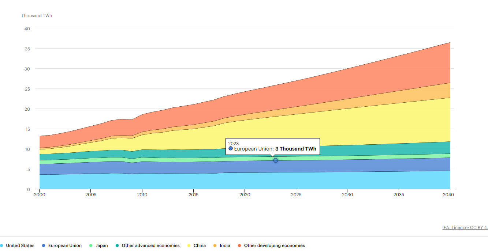

3000 TWh = 3.000.000.000.000.000 Watt-ora

Ce ne vorrà di più in futuro ?

Note:
- Un asciugacapelli di 2000 W accesso un'ora quanto consuma?
- Accesso due ore? (1 anno=17.5MWh)
- 3000 TWh sono 171 millioni di acciugacappelli accessi in permanenza

[comment]: # (!!! data-auto-animate)
## Elettricità nel mondo 2/2

- Elettrificazione come motore della riduzione CO2
- Elettronica sempra più potente e presente

E' ora di guardarci da vicino

Note:
- Esempio delle macchine elettriche vs. a combustione
- Graduale sostituzione fossili con altre forme di energia e elettricità
- Chiedere se l'hanno mai vista l'elettricità ?

[comment]: # (!!! data-auto-animate)

## L'elettricità visibile 1/2

- In natura?...

---

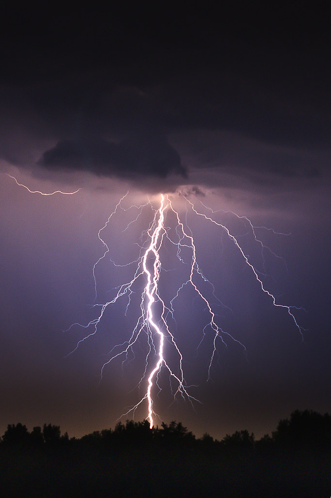 <!-- .element: style="height:400px; max-width:200vw; image-rendering: crisp-edges;" -->

Scarica di elettricità fra la nuvola e il suolo

Note:
- Elettricità "scorre" come un fluido
- C'è l'elettricità anche negli esseri viventi (impulsi nervosi)

[comment]: # (!!! data-auto-animate)

## L'elettricità visibile 2/2

- Elettricità statica

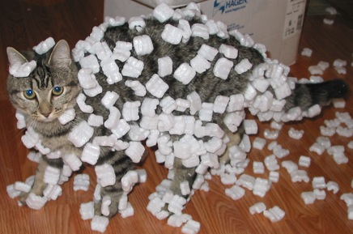

Cosa è successo in questa immagine ?
Cosa trattiene il polistirolo al gatto ?

Note:
- "ELETTRICITA' STATICA" è la parola
- Dato che non si vede spesso, si sono voluti due milleni per iniziare a capirla. Noi abbiamo 5 lezioni

[comment]: # (!!!)

## Esperimento con palloni

A gruppi di due bambini, uno strofina il pallone sulla maglietta dell'altro

- Cosa succede al pallone ? 
- Cosa succede ai vostri cappelli ?
- E fra due palloni ?

---

[Spiegazione](https://phet.colorado.edu/sims/html/balloons-and-static-electricity/latest/balloons-and-static-electricity_en.html)

- Il movimento "carica" positivamente il pallone e "negativamente" la maglietta
- Le cariche uguali si rispongono, le cariche opposte si attragono

Note:
- Spiegazione cariche 
- Forza elettrostatica (Legge di Coulomb)

---
## Una carica può crearne un'altra

- Pallone con pezzi di carta

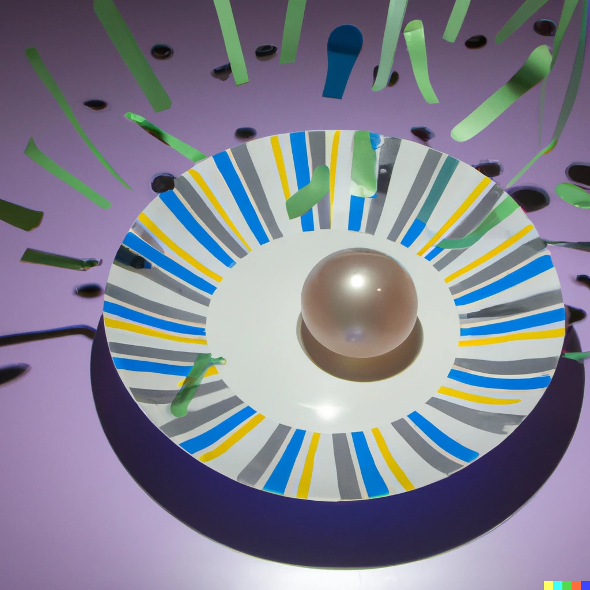

Note:
- Induzione elettrostatica
- https://www.stem.org.uk/resources/elibrary/resource/27020/electric-sausage

[comment]: # (!!!)

### Definizione elettricità

Il nome provviene dalla parola greca per l'*ambra gialla* in Greco

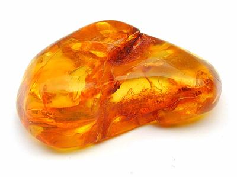

- Ricordate l'atomo ? Com'è fatto ?

Note:
- Primo studioso dell'ettricità Talete (600 a.C) - lo stesso del teorema
- Avevano visto che come il pallone l'ambra strofinata attraeva piccoli oggetti

---

### Definizione elettricità

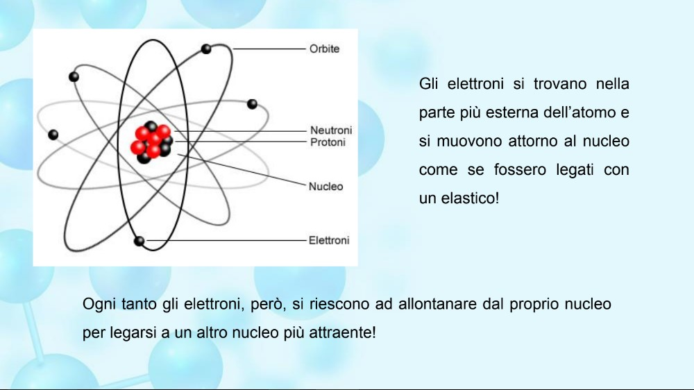 <!-- .element: style="height:250px; max-width:200vw; image-rendering: crisp-edges;" -->

Quali parti sono cariche elettricamente in questa immagine?

Note:
- Importante sottolineare che tutta la materia è fatta da atomi
- Ci sono particelle cariche in ogni atomo
- Le cariche elettriche sono dapertutto, non solo nell'elettricità

[comment]: # (!!! data-auto-animate)

### Definizione elettricità

Dobbiamo fare un po' di storia

"Fluido elettrico" di Benjamin Franklin (1757)

- Capì che esistevano cariche diverse (+ e -)
- Decise lui che la corrente va dal + al -

---

Benjamin Frankin è famoso per l'invenzione del parafulmine

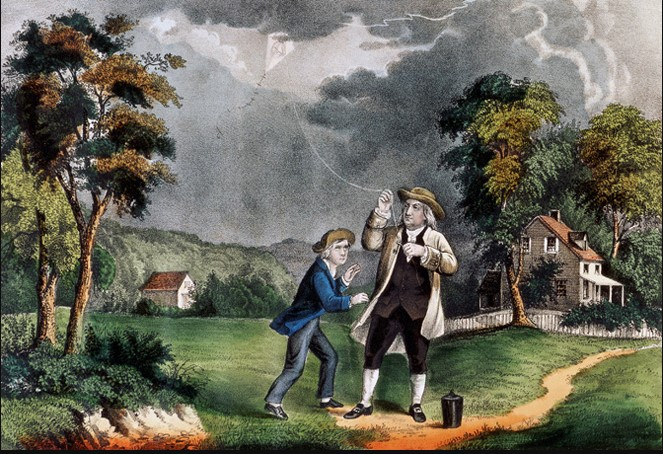

[comment]: # (!!! data-auto-animate)

_Non è famoso per rispettare la sicurezza dei bambini_

[comment]: # (!!! data-auto-animate)

### Definizione elettricità

Tutti pensavano allora che l'elettricità fosse una specie di liquido invisible

- Scoperta dell'elettrone grazie ai "raggi catodici" (Thomson, 1897)

<iframe width="560" height="315" src="https://www.youtube.com/embed/8Q5QuXh2XH0" title="YouTube video player" frameborder="0" allow="accelerometer; autoplay; clipboard-write; encrypted-media; gyroscope; picture-in-picture; web-share" allowfullscreen></iframe>

---

Allora si capì che l'elettricità erano delle cariche in movimento

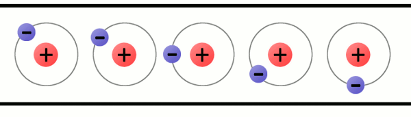

Note:
- Perché non si muovono i protoni invece? 10.000 volte più pesanti degli elettroni.

[comment]: # (!!! data-auto-animate)

### Definizione elettricità

Elettricità 
: cariche in movimento

Ma movimento in quale direzione ?

- Senso convenzionale della corrente in un circuito (Franklin)

<iframe src="media/conventional-current.mp4" frameborder="0" allow="accelerometer; autoplay; clipboard-write; encrypted-media; gyroscope; picture-in-picture" allowfullscreen></iframe>

Note:
- Si userà la convenzione usuale nel corso
- Domande di verifica: cariche positive/negative, atomo

[comment]: # (!!! data-auto-animate)
### Esercizio di classe

Analogia della corda
1. Tutti i bambini tengono la corda senza stringerla
2. Un bambino stringe leggermente la corda
3. L'insegnante inizia a fare scorrere la corda fra le sue mani

Note:
- E' solo un'analogia della corrente, non è perfetto (ad es. la tensione è problematica)
- Conservazione della carica <-> conservazione della corda che entra/esce, non si "consuma" la carica
- Movimento delle cariche simultaneo della corda
- Analogia della resistenza che scalda la mano ma non degli altri

[comment]: # (!!!)

### Conduttori e isolanti #1

- Altro esperimento

Tester di continuità e vari materiali, chi conduce bene e chi no (insegnante)
I bimbi portanno i materiali da testare all'istruttore con il tester

Note:
- Chi conduce bene l'elettricità? Metalli
- I buoni conduttori hanno elettroni liberi di spostarsi

[comment]: # (!!!)

### Conduttori e isolanti #2

- Teoria: Facilità a strappare elettroni

[Simulazione](https://javalab.org/en/electric_current_en/)

Alcuni atomi "si tengono stetti" i loro elettroni (isolanti)
Altri li possono prestare (conduttori)

[comment]: # (!!!)

### Misura dell’elettricità

Tante unità diverse per l'elettricità
- L'unità di Alessandro Volta (inventore della pila)
- L'unità di André-Marie Ampère 
- L'unità di Georg Ohm
- e molte altre (Watt, Farad, Henry, Coulomb)...

---

Secondo voi chi se l'è passata meglio fra i tre?

[comment]: # (!!! data-auto-animate)
Volta divenne senatore e ebbe la sua villa a Como

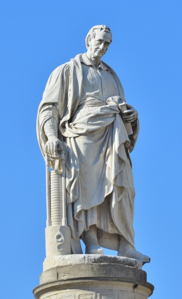

[comment]: # (!!! data-auto-animate)
Ampère ha il suo nome inciso nella Torre Eiffel

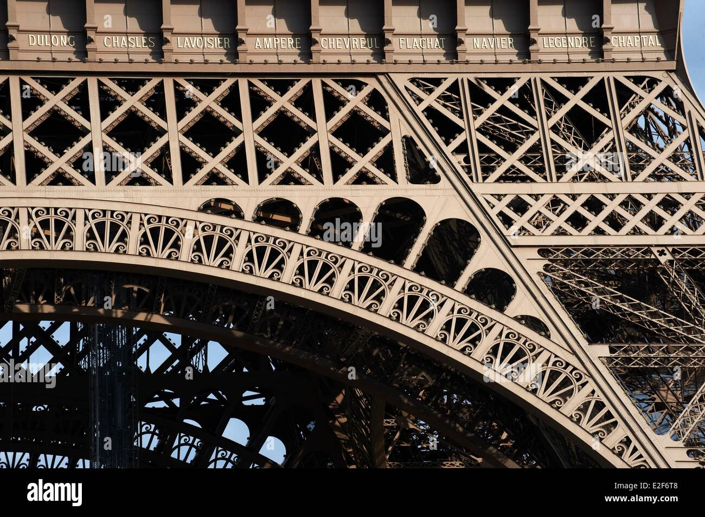

[comment]: # (!!! data-auto-animate)
Ohm non fu creduto e rinuncio al posto in università

[comment]: # (!!!)

### Misura dell’elettricità

Ricordiamo 3 grandezze

| Grandezza | Unità | Simbolo | Spiegazione |
| -- | -- | -- | -- |
| *Corrente* | Ampère | A | Flusso delle cariche elettriche |
| *Tensione* | Volt   | V o U | Potenziale delle cariche elettriche |
| *Resistenza* | Ohm | Ω | "Freno" alle cariche elettriche |
 
Note:
- La corda evita l'errore di pensare che le cariche vengono dalle batterie, sono già presenti

[comment]: # (!!!)
### Il multimetro

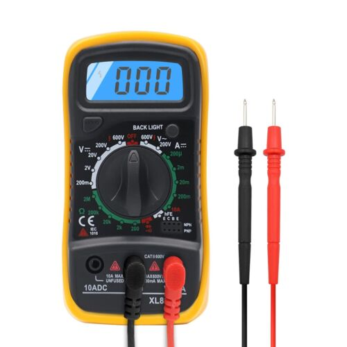

Com'è fatto? Come si accende ? Colori dei fili ?

Note:
- Come si misura una tensione ? Simbolo V DC
- La tensione si misura fra due punti del circuito
- La tensione si misura "IN PARALLELO" ai due punti

[comment]: # (!!!)
### Esperimento

- Misurare tensione di una pila
- Di due pile
- Disposte in modo diverso

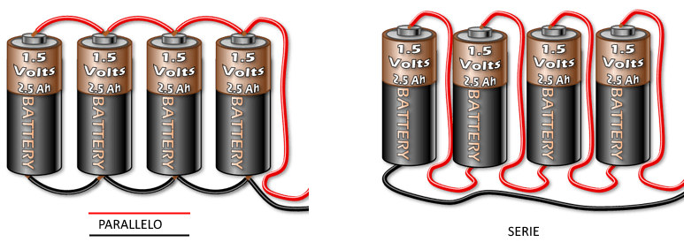

- Ipotesi di classe : cambierà qualcosa?

### Esperimento

Esperimenti a gruppo e raccolte misure

Note:
- Obiettivo è che tutti i bambini sappiano misurare una tensione
- Raccolta valori

---

### Conclusioni esperimento

| Configurazione | Valore misurato | Conclusione |
| -- | -- | -- |
| 1 Pila | ??? | ??? |
| Pile una dopo l'altra (serie) | ??? | ??? |
| Pile connesse in parallelo (//) | ??? | ??? |
| Pile che non si toccano | ??? | ??? |

Note:
- Generatori di tensione in serie si sommano
- In parallelo, non si sommano (quando hanno la stessa tensione)

[comment]: # (!!!)

### Effetti dell’elettricità

- Produce calore, luce (lampadine)
- Movimento (motori)
- Rischi (pericolo tensioni sul corpo umano)

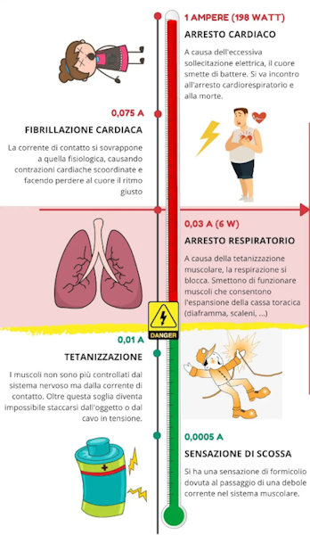

Note:
- Insistere che non si gioca con l'elettricità 

[comment]: # (!!!)

### Riassunto finale

Elettricità
: cariche in movimento

Conduttori e isolanti

Unità di misura
- Ampère per il flusso di cariche
- Volt per il potenziale elettrico
- Ohm per la resistenza al flusso di cariche

Note:
- se c'è tempo elettrolisi acqua salata

[comment]: # (
    Fonti
    STEM website
    AISTAP Chimica Dott. Carlini
    Sparkfun Creative commons https://learn.sparkfun.com/tutorials/what-is-electricity/all
    "Ka-boom (lightning)" by Leszek.Leszczynski is licensed under CC BY 2.0.)
    IEA, Global electricity demand by region in the Stated Policies Scenario, 2000-2040, IEA, Paris https://www.iea.org/data-and-statistics/charts/global-electricity-demand-by-region-in-the-stated-policies-scenario-2000-2040, IEA. Licence: CC BY 4.0
    )