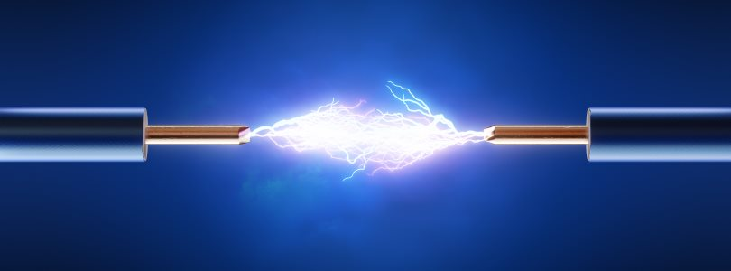
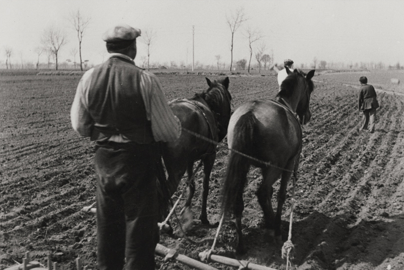
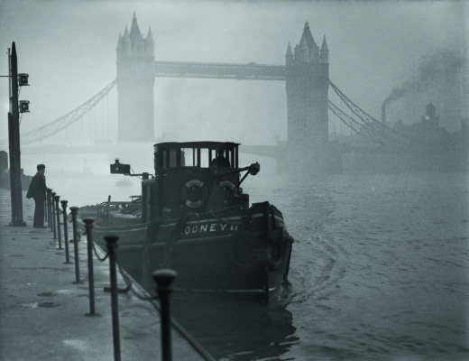
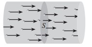
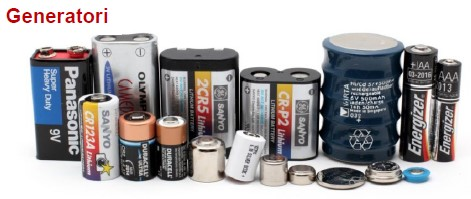

[comment]: # (THEME = league)
[comment]: # (CODE_THEME = base16/zenburn)
[comment]: # (controls: true)
[comment]: # (keyboard: true)
[comment]: # (markdown: { smartypants: true })
[comment]: # (hash: false)
[comment]: # (respondToHashChanges: false)
[comment]: # (slideNumber: true)

Benvenuti

Note:
- Disporre i ragazzi a gruppi

[comment]: # (!!!)

## Elettronica con Micropython
 <!-- .element: style="height:250px; max-width:200vw; image-rendering: crisp-edges;" -->

Pascal Brunot | AISTAP | Luglio 2023

Lezione 1 : Elettricità

Note:
- Capire il concetto di carica (con elettricità statica)
- L'elettricità come un flusso di cariche
- Distinguere conduttori e isolanti
- Necessità di un circuito chiuso per il flusso (corda)
- Definizioni e unità di corrente, tensione, resistenza
- Approccio scientifico (ipotesi, esperimento, risultati, conclusioni)
- Imparare a fare misura di tensione con il multimetro

[comment]: # (!!! data-background-color="aqua")

## Introduzione

Perché queste due parole assieme ? Cosa possono fare ?

<iframe width="560" height="315" src="https://www.youtube.com/embed/aXW4dqvjFx0" title="YouTube video player" frameborder="0" allow="accelerometer; autoplay; clipboard-write; encrypted-media; gyroscope; picture-in-picture; web-share" allowfullscreen></iframe>

[comment]: # (!!!)
## Introduzione

1. Per programmare questi robot ci vuole ... Micropython
2. Per capire i componenti elettronica ci vuole... un po' di fisica
3. Inizieremo a capire l'elettricità nelle prossime lezioni

Note:
- Chiarire che non costruiremo un robot ma qualcos'altro

[comment]: # (!!!)

## Regole del corso

1. Si alza la mano per prendere la parola, a qualunque momento
2. Si ascoltano le domande degli altri
3. Non c'è una gara, non c'è un voto
4. Condividete il materiale che avete a disposizione

Note:
- Chiarire che non costruiremo un robot ma qualcos'altro

[comment]: # (!!!)

## Lezione 1

Elettricità

Note:
- Oggi sarà la lezione più teorica di tutte perché dobbiamo imparare i concetti ma ci divertiremo anche facendo esperimenti
- Materiali richiesti: palloni, pezzi di carta tagliati, piatto, corda 5-10m un po spessa
- Pile elettriche 1.5 V (2 a ragazzi), fili, alluminio, scotch
- Acqua / Acqua salata, monetine, ferro
- Alcuni multimetri

[comment]: # (!!!)

## Elettricità a casa

E' importante l'ettricità oggi ?

Vediamo senza

Note:
- Avete già avuto un black out a casa? Come vi siete sentiti ?
- Chiedere a cosa serve l'elettricità?
- Acqua potabile (pompe), Forno elettrico, luce, conservazione del cibo

[comment]: # (!!!)

## Elettricità nella società

"Motore" della società moderna

_E per gli esseri viventi ?_

Note:
- Avere più energia a disposizione ha consentito alla popolazione umana di vivere in grandi città
- Menzionare idrocarburi come secondo "motore"
- Nervi
- Sapete come è stato scoperto ? Scienfico italiano, Galvani e le rane (1781)

[comment]: # (!!!)

## E prima ?

E' sempre stato così importante nella nostra vita?

Note:
- Cosa usavamo prima ? carbone, legna, animali

[comment]: # (!!! data-auto-animate)

## Animali, legna, carbone

E' sempre stato così importante nella nostra vita?

Note:
- Adesso cosa si usa al posto degli animali ?
- Siamo diventati meno contadini e più urbani in poche decenni

[comment]: # (!!!)

## Vantaggi

_Ma perché è così comoda l'elettricità?_

_Da dove proviene l'elettricità che abbiamo in casa ?_

Note:
- Non inquina ed è facile da trasportare
- "Vettore energetico"
- Centrali elettriche (idroelettriche, termiche gas/carbone, eolico, solare, ...)
- La generazione può essere pulita spesso non lo è

[comment]: # (!!!)

## Quanta elettricità ?

- Elettricità nel mondo - tanta o poca?

---

3000 TWh = 3.000.000.000.000.000 Watt-ora

Ce ne vorrà di più in futuro ?

Note:
- Prima unità di misura, James Watt (1776 - macchina a vapore efficiente)
- Un asciugacapelli di 2000 W accesso un'ora quanto consuma?
- Accesso due ore? (1 anno=17.5MWh)
- 3000 TWh sono 171 millioni di acciugacappelli accessi in permanenza

[comment]: # (!!! data-auto-animate)

## Come la usiamo?

Elettrificazione come motore della riduzione CO2

Note:
- Dicembre 1952, 4000 morti, 100000 malati per via dello smog (carbone)
- Esempio delle macchine elettriche vs. a combustione
- Graduale sostituzione fossili con altre forme di energia e elettricità
- La combustione dei carburanti fossili producono CO2 nell'atmosfera che assorbe il calore (infrarossi) emesso dal suolo
- 2400 GT dalla fine della seconda guerra mondiale... ne possiamo emettere 1200 GT max per stare <2.5°C

[comment]: # (!!! data-auto-animate)

## Elettricità nel mondo 3/3

Elettronica sempra più potente e presente

Note:
- Chiedere se l'hanno mai vista l'elettricità ?
- E' ora di guardarci da vicino

[comment]: # (!!! data-auto-animate)

## L'elettricità visibile 1/2

- In natura?...

---

 <!-- .element: style="height:400px; max-width:200vw; image-rendering: crisp-edges;" -->

Scarica di elettricità fra la nuvola e il suolo

Note:
- Elettricità "scorre" come un fluido
- C'è l'elettricità anche negli esseri viventi (impulsi nervosi, Galvani)

[comment]: # (!!! data-auto-animate)

## L'elettricità visibile 2/2

Cosa è successo in questa immagine ?

Cosa trattiene il polistirolo al gatto ?

Note:
- "ELETTRICITA' STATICA" è la parola
- Dato che non si vede spesso, si sono voluti due milleni per iniziare a capirla. Noi abbiamo 5 lezioni

[comment]: # (!!!)

## Esperimento con palloni

&#x1F6B8; A gruppi di due bambini, uno strofina il pallone sulla maglietta dell'altro

&#x1F6B8; Sentite qualcosa ?

&#x1F6B8; Cosa succede ai vostri cappelli quando avvicinate il pallone ?

&#x1F6B8; Cosa succede quando avvicinate due palloni ?

&#x1F6B8; Potete scaricare un pallone ?

---
## Esperimento con palloni

[Spiegazione](https://phet.colorado.edu/sims/html/balloons-and-static-electricity/latest/balloons-and-static-electricity_en.html)

Il movimento "carica" positivamente il pallone e "negativamente" la maglietta

Le cariche uguali si rispongono, le cariche opposte si attragono

Note:
- Spiegazione cariche 
- Dove sono le cariche ? Alla superficie del pallone
- Forza elettrostatica (Legge di Coulomb)

[comment]: # (!!!)

### Definizione elettricità

Il nome provviene dalla parola greca per l'*ambra gialla* in Greco

Ricordate l'atomo ? Com'è fatto ?

Note:
- Primo studioso dell'ettricità Talete (600 a.C) - lo stesso del teorema
- Avevano visto che come il pallone l'ambra strofinata attraeva piccoli oggetti

[comment]: # (!!!)

### Definizione elettricità

 <!-- .element: style="height:250px; max-width:200vw; image-rendering: crisp-edges;" -->

Quali parti sono cariche elettricamente in questa immagine?

Note:
- Importante sottolineare che tutta la materia è fatta da atomi
- Ci sono particelle cariche in ogni atomo
- Le cariche elettriche sono dapertutto, non solo nell'elettricità

[comment]: # (!!! data-auto-animate)

## Induzione elettrostatica

Pallone con pezzi di carta. La carta è carica ?

Note:
- Induzione elettrostatica
- Cosa è successo ?
- https://www.stem.org.uk/resources/elibrary/resource/27020/electric-sausage

[comment]: # (!!!)

## Induzione elettrostatica

La presenze di cariche nel pallone ha allontanato gli elettroni nella carta

Così, la carta si è caricata positivamente da un lato, e negativamente dall'altro

Ma perché è stata attrata ? Dopotutto, l'altra parte era respinta...

[Simulatore](https://javalab.org/en/electrostatic_induction_metal_bonding_en/)

Note:
- La parte carica positivamente è più vicina alle cariche negative
- La forza dipende dalla distanza (dal quadrato in realtà, come la gravità)
- La forza attrattiva è quindi maggiore rispetto alla forza repulsiva e la carta vola
- L'obiettivo di questa dimostrazione è di mostrare che le cariche sono presenti dapertutto, non solo in oggetti positivamente/negativamente carichi

[comment]: # (!!!)

## Quizz

_perché questo bambino ha i cappelli rizzati ?_

Note:
- Strisciando sullo scivolo si sono spostate delle cariche fra bambino e scivolo (come il movimento per caricare il pallone)
- Il risultato è che, come il pallone, il bambino ha una carica elettrica sul suo corpo (e lo scivolo ha la carica esattamente opposta)
- Le cariche uguali si rispongono e i capelli vogliono stare più lontano possibili gli uni dagli altri
- Se i cappelli sono bagnati non funziona, perché l'acqua è un conduttore

[comment]: # (!!!)

### Il fluido elettrico (1757)

Dobbiamo fare un po' di storia con Benjamin Franklin

Capì lui che esistono solo cariche positive e negative

Capì lui che le cariche non si creano, si spostano soltanto

Decise lui che la corrente va dal + al -

Note:
- Franklin è anche famoso per essere un padre fondatore degli Stati Uniti d'America, un musicista, uno scacchista, un impreditore, un giornalista
- Prima di lui si pensava che le cariche erano diverse da materiale a materiale (cariche dallo scivolo, del capello, ...)

---

Benjamin Frankin è famoso per l'invenzione del parafulmine (1752)

Note:
- Nel quadro sopra, Franklin voleva dimostrare che le nuvole sono cariche (come i nostri palloni)
- Filo elettrico avvolto attorno al filo dell'acquilone, terminava con una chiave
- Riuscì a osservare scariche elettriche all'estremità della chiave al riparo del portico di casa

[comment]: # (!!! data-auto-animate)

_Non è famoso per rispettare la sicurezza dei bambini_

Note:
- Se il fulmine avesse colpito il loro acquilone loro sarebbero stati uccisi
- Parafulmine faceva paura alle popolazioni, attraeva la colera di Dio 
- Si sarebbero evitati 3000 morti a Brescia quando un fulmine colpì la polveriera nel 1769

[comment]: # (!!! data-auto-animate)

### Definizione elettricità 2/3

Tutti pensavano allora che l'elettricità fosse una specie di liquido invisible

Scoperta dell'elettrone grazie ai "raggi catodici" (Thomson, 1897)

<iframe width="560" height="315" src="https://www.youtube.com/embed/8Q5QuXh2XH0" title="YouTube video player" frameborder="0" allow="accelerometer; autoplay; clipboard-write; encrypted-media; gyroscope; picture-in-picture; web-share" allowfullscreen></iframe>

Note:
- Il passaggio degli elettroni fa emettere luce verde al fosforo
- Si vede anche che sono sensibili al magnete, lo vedremo nella seconda lezione

---

Allora si capì che l'elettricità erano delle cariche in movimento!

Note:
- Perché non si muovono i protoni invece? 10.000 volte più pesanti degli elettroni.

[comment]: # (!!! data-auto-animate)

### Definizione elettricità 3/3

Un movimento in quale direzione ? 

Franklin decise il senso convenzionale della corrente in un circuito 

<iframe src="media/conventional-current.mp4" frameborder="0" allow="accelerometer; autoplay; clipboard-write; encrypted-media; gyroscope; picture-in-picture" allowfullscreen></iframe>

Note:
- Si userà la convenzione usuale nel corso
- Franklin visse un secolo prima di Thomson... non poteva sapere degli elettroni
- Domande di verifica: cariche positive/negative, atomo

[comment]: # (!!!)

## Come circola la corrente elettrica?

&#x1F6B8; La corda

1. Un gruppo di ragazzi tengono la corda senza stringerla
2. Uno stringe leggermente la corda
3. L'insegnante inizia a fare scorrere la corda fra le sue mani
4. Aggiungiamo un ragazzo che stringe al massimo

Note:
- E' solo un'analogia della corrente, non è perfetto (ad es. la tensione è problematica, si potrebbe approssimare con altezza della corda...)
- Conservazione della carica <-> conservazione della corda che entra/esce, non si "consuma" la carica
- Movimento delle cariche simultaneo della corda (non si muove prima da una parte)
- La corrente è la stessa in tutto il circuito (la corda non circola più veloce da una parta rispetto all'altra)
- Analogia della resistenza che scalda la mano ma non degli altri
- La corda evita l'errore di pensare che le cariche vengono dalle batterie, sono già presenti

[comment]: # (!!!)

### Conduttori e isolanti #1

Tutti i materiali fanno passare le cariche?

&#x1F6B8; Prova con tester di continuità + vari materiali

Note:
- Chi conduce bene l'elettricità? Metalli
- I buoni conduttori hanno elettroni liberi di spostarsi
- I ragazzi portanno i materiali da testare all'istruttore con il tester

[comment]: # (!!!)

### Conduttori e isolanti #2

Usiamo un simulatore per vedere:

[JavaLab](https://javalab.org/en/electric_current_en/)

- Alcuni atomi "si tengono stetti" i loro elettroni (isolanti)
- Altri li possono prestare (conduttori)

[comment]: # (!!!)

### Misura dell’elettricità

Tante unità diverse per l'elettricità
- L'unità di Alessandro Volta (inventore della pila)
- L'unità di André-Marie Ampère 
- L'unità di Georg Ohm
e molte altre (Watt, Farad, Henry, Coulomb) che non useremo...

Note:
- Vediamo questi tre scienzati da dove venivano
- Volta, Italia. Ampère, Francia. Ohm, Germania.

---

Secondo voi chi se l'è passata meglio fra i tre scienzati ?

[comment]: # (!!! data-auto-animate)
Volta divenne senatore e ebbe la sua villa a Como

[comment]: # (!!! data-auto-animate)
Ampère ha il suo nome inciso nella Torre Eiffel

[comment]: # (!!! data-auto-animate)
Ohm non fu creduto e rinunciò al posto in università

[comment]: # (!!!)

### Misura dell’elettricità

Ricordiamo 3 grandezze

| Grandezza (Abbr.) | Unità | Simbolo | Spiegazione |
| -- | -- | -- | -- |
| *Corrente* (I) | Ampere | A | Flusso delle cariche elettriche |
| *Tensione* (U o V) | Volt   | V | Potenziale delle cariche elettriche |
| *Resistenza* (R) | Ohm | Ω | "Freno" alle cariche elettriche |
 
Note:
- Tensione come differenza di altitudine che fa scorrere l'acqua del fiume
- I simboli delle unità che provvengono da un personaggio storico sono in maiuscole (A non a)
- Non si usano gli accenti nelle unità (Ampère->Ampere)
- Alle unità si possono aggiungere i soliti prefissi come per le lunghezze (milli-m, chilo-k, mega-M)
- Domande : che corrente fa 100 mA + 1 A in A ?
- Domande : che tensione c'è fra 1 kV - 500 V in V ?

[comment]: # (!!!)

### Il multimetro

Com'è fatto? Come si accende ? Colori dei fili ?

Note:
- Per misurare le tre unità di prima si può usare il MULTIMETRO
- Come si misura una tensione ? Simbolo V DC
- La tensione si misura fra due punti del circuito
- La tensione si misura "IN PARALLELO" ai due punti
- Accendete e mettelo su misura di tensione

[comment]: # (!!!)

### Esperimento

&#x1F6B8; Misurare tensioni

- Misurare tensione di una pila
- Di due pile attaccate
- Disposte in modo diverso

[TinkerCad](https://www.tinkercad.com/things/kFyHZJa3gyv)

- Ipotesi di classe : cambierà qualcosa?

Note:
- Far votare i bambini a mano alta

[comment]: # (!!!)

### Risultati esperimento

&#x1F6B8; Risultati

| Configurazione | Valore misurato | Conclusione |
| -- | -- | -- |
| 1 Pila | ??? | ??? |
| Pile una dopo l'altra (serie) | ??? | ??? |
| Pile connesse in parallelo (//) | ??? | ??? |
| Pile che non si toccano | ??? | ??? |
| Portabatterie | ??? | ??? |

Note:
- Obiettivo è che tutti i bambini sappiano misurare una tensione
- Raccolta valori
- Generatori di tensione in serie si sommano
- In parallelo, non si sommano (quando hanno la stessa tensione)

[comment]: # (!!!)

### Rappresentazione schematica

Le "pile" sono un tipo di "generatore di tensione"

Esistono due simboli per questi concetti

Note:
- A cosa servono i simboli ? A disegnare schemi elettrici più complessi
- A trasmettere in modo preciso le informazioni (rispetto ad una lettera)

[comment]: # (!!!)

### Effetti dell’elettricità

Produce calore, luce (lampadine)

Movimento (motori)

&#9888; Ma è molto pericolosa &#9888;

Note:
- Ricordare contrazione muscolari (Galvani e le rane)
- Insistere che non si gioca con l'elettricità 
- In questo corso useremo tensioni <= 5V e correnti limitate continue
- Il grafico è valido per tensioni attorno a 200 V
- La corrente alternata è più pericolosa della corrente continua

[comment]: # (!!!)

### Riassunto finale

Elettricità
: cariche in movimento

Conduttori e isolanti

Unità di misura
- Ampere per il flusso di cariche
- Volt per il potenziale elettrico
- Ohm per la resistenza al flusso di cariche

Note:
- se c'è tempo elettrolisi acqua salata

[comment]: # (!!!)

### Prossima lezione

Chi deve installare Thonny e il driver sul proprio computer?

Note:
- Verificare che siano tutti più o meno pronti con Thonny per la prossima lezione
- Per la lezione 2 non serve la connessione alla board

[comment]: # (!!!)