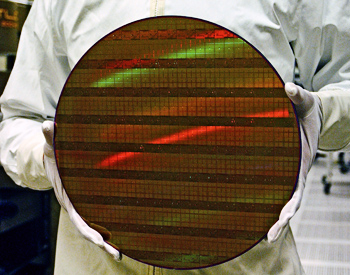
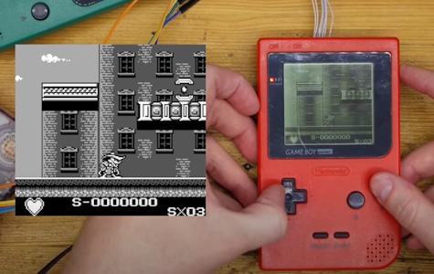

[comment]: # (THEME = league)
[comment]: # (CODE_THEME = base16/zenburn)
[comment]: # (controls: true)
[comment]: # (keyboard: true)
[comment]: # (markdown: { smartypants: true })
[comment]: # (hash: false)
[comment]: # (respondToHashChanges: false)
[comment]: # (slideNumber: true)


<style>
.reveal h1 { font-size: 2.5em; }
</style>
<style type="text/css">
    :root {
        --r-main-font-size: 32px;
    }
</style>
<style type="text/css">
.twocolumn {
   display: grid;
   grid-template-columns: 1fr 1fr;
   grid-gap: 10px;
   text-align: left;
}
</style>

[comment]: # (!!!)

## Elettronica con Micropython

 <!-- .element: style="height:250px; max-width:200vw; image-rendering: crisp-edges;" -->

Pascal Brunot | AISTAP | Luglio 2023

Lezione 3 : semi-conduttori, diodi, board ESP32

[comment]: # (!!! data-background-color="aqua")

## I semi-conduttori

I componenti che abbiamo usati fin'ora erano "lineari"

Alcuni materiali possono essere sia isolanti che conduttori a secondo delle condizioni

Li chiamiamo semi-conduttori

Note:
- Lineari perché per resistenze U = R x I, Induttanze U = L x dV/dt, Capacità I =C x dV/dt
- Esempi : diodi, transistori, celle fotovoltaiche
- Ricordate perché alcuni materiali lasciano passare la corrente elettrica? (gli elettroni stretti o meno)

[comment]: # (!!!)

## La giunzione P-N

L'ingrediente fondamentale del diodo, creata nel 1939


Note:
- Ci stiamo avvicinando pian piano ai nostri giorni
- Prima di usare un semiconduttore dobbiamo capire il principio fisico che lo rende possibile.
- Valutare come tagliare il video. E' interessante ma troppo lungo.

[comment]: # (!!!)

## Proviamo il diodo elettroluminescente ("LED")

<div class="twocolumn">
<div>

Riconoscere anodo da catodo

Simbolo


</div>
<div>


</div>
</div>

[comment]: # (!!!)

## Esperimento 1 - LED e tensioni nel circuito

&#x1F6B8; Collegare come da schema con le vostre pile e la resistenza

[TinkerCad](https://www.tinkercad.com/things/8zAUERdv001)

&#x1F6B8; Misurate la tensione attorno al LED (1) e alla resistenza (2)

<small>

| Gruppo | Colore | Tensione U(LED) | Tensione U(R) |
| -- | -- | -- | -- |
| 1 | -- | ..... V | .... V |
| 2 | -- | ..... V | .... V |
| 3 | -- | ..... V | .... V |
| 4 | -- | ..... V | .... V |
| 5 | -- | ..... V | .... V |
| 6 | -- | ..... V | .... V |

</small>

Note:
- Fare osservare che U(LED) + U(R) = U(pile) - Legge di Kirshoff
- La caduta di tensione è dovuta alla giunzione P-N ed è indipendente dalla corrente (non si può applicare la legge di Ohm al diodo)
- Fare calcolare la corrente nel circuito ? (utile per ritornare su corrente uguale e legge di Ohm)

[comment]: # (!!!)

## Circuiti integrati

Tanti transistor messi assieme per uno scopo (memorizzare, fare operazioni logiche)

Economici da fabbricare in grandi quantità

- Fabbrichiamo migliari di migliardi di transistor ogni anno



Note:
- Esistono circuiti integrati per tutte le operazioni comuni in elettronica
- Esistono circuiti integrati che sono capaci di ricevere istruzioni da altri circuiti e di eseguirle
- Diventano così "microprocessori" o più semplicemente "processori"


[comment]: # (!!!)

## Struttura della board S2 PICO

<div class="twocolumn">
<div>

- Microprocessore con memoria integrata
- Antenna WiFi
- Interrutori ("switch")
- Resistenze, Condensatori
- Componenti di alimentazione
- Ingressi/Uscite del controllore (GPIO)
- Bus (USB x PC, SPI x LCD)
- Pulsanti (RESET, GPIO0)
- Schermo LCD (128x32 pixels)

</div>
<div>


</div>
</div>

Note: prendete la board e guardatela tutti

[comment]: # (!!!)

## Unità di misura : velocità

Processore: la frequenza alla quale prende istruzioni
- 1 Hertz = 1 istruzione al secondo
- Il nostro può arrivare a 240.000.000 Hz

E' un processore molto potente



Note:
- Con questa board abbiamo abbastanza potenza per una console di gioco

[comment]: # (!!!)

## Unità di misura : memorie

*Memoria volatile* (RAM)
- Circa 2 millioni di bytes (2 Mb)
- Viene persa quando perde la corrente

*Memoria flash*
- Circa 4 millioni di bytes (4Mb)
- Rimane anche senza corrente grazie ad un condensatore

Note:
- Il tedesco Heinrich Rudolf Hertz scoprì le onde elettromagnetiche nel 1885
- Quando sentite parlare di Gigabytes? cosa vuole dire?
- Qual'è la memoria più veloce? La PSRAM (10-50ns vs. 500 us)

[comment]: # (!!!)

## Esperimento 2 - Board S2 PICO

&#x1F6B8; Collegamento USB al computer

&#x1F6B8; Individuare la porta seriale (COM)

&#x1F6B8; Configurare Thonny per usare ESP32 con porta COM

&#x1F6B8; Nel REPL dovreste vedere Micropython

&#x1F6B8; Accendere il led blu sulla board

```python
Pin(10).on()
```

Note:
- Porta seriale varia da computer
- Tutti devono collegare il computer una volta
- Quando scollegano la board si spegne il LED

[comment]: # (!!!)

&#x1F6B8; Spegnere il led blu sulla board

```python
Pin(10).off()
```

Note:
- Porta seriale varia da computer

[comment]: # (!!!)

## Come provare senza essere connesso alla BOARD

[WOKWI ESP32](https://wokwi.com/projects/new/micropython-esp32)


Note:
- Serve connessione internet
- Possibile collegare vari componenti

[comment]: # (!!!)

## Premi ai gruppi scientifici più precisi

* Migliore precisione per la verifica esperimentale delle resistenze in parallelo ?

* Migliore precisione per la verifica esperimentale delle tensioni in un circuito ?

Vince chi ha l'errore più piccolo

$$ Errore = \lvert \frac{Misura - Teoria}{Teoria} \rvert $$

Note:
- Usare foglio excel a supporto e dati raccolti sui moduli
- Premio potrebbe essere un LED? Il pallone di elio?

[comment]: # (!!!)

## Conclusioni

Sito Micropython (dove scaricare firmware e documentazione)

[Micropython](https://micropython.org/)

Componenti usati

- [S2 Pico](https://www.wemos.cc/en/latest/s2/s2_pico.html)

- [Ali Express](https://it.aliexpress.com/item/1005003215673294.html) 

- [APA 106](https://it.aliexpress.com/item/1005001863273661.html)

[comment]: # (!!!)