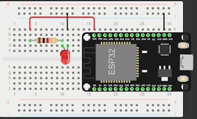
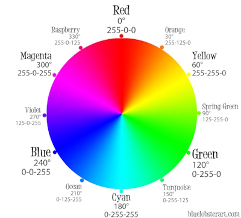

[comment]: # (THEME = league)
[comment]: # (CODE_THEME = base16/zenburn)
[comment]: # (controls: true)
[comment]: # (keyboard: true)
[comment]: # (markdown: { smartypants: true })
[comment]: # (hash: false)
[comment]: # (respondToHashChanges: false)
[comment]: # (slideNumber: true)


<style>
.reveal h1 { font-size: 2.5em; }
</style>
<style type="text/css">
    :root {
        --r-main-font-size: 32px;
    }
</style>
<style type="text/css">
.twocolumn {
   display: grid;
   grid-template-columns: 1fr 1fr;
   grid-gap: 10px;
   text-align: left;
}
</style>

[comment]: # (!!!)

## Elettronica con Micropython

 <!-- .element: style="height:250px; max-width:200vw; image-rendering: crisp-edges;" -->

Pascal Brunot | AISTAP | Luglio 2023

Lezione 4 : Micropython, board S2 PICO

Note:
- Thonny, salvare file sul microprocessore
- Blink con LED interno
- Scrivere sul LCD
- LED esterno pilato da GPIO
- Blink alternati

[comment]: # (!!! data-background-color="aqua")

## Micropython

Micropython e Python

[micropython.org](https://micropython.org/)

Librerie (<code>import X / from X import A</code>)

Note:
- Storia di Micropython, creato da un fisico teorico australiano
- Kickstarter per finanziare il progetto, è stato poi usato a bordo di satelliti
- E' un Python più leggero per microprocessori, bastano KB invece di MB di RAM

[comment]: # (!!!)

## Teoria

Come programmare senza board ? WOKWI

[comment]: # (!!!)

## Micropython: Sequenza di boot

Quando si accende il computer, parte il sistema operativo

Con Micropython al "power-on" / "reset"
- Esegue il file boot.py
- Esegue il file main.py * noi lavoremo qua *

[comment]: # (!!!)

## Librerie utili

E' molto importante riusare codice già testato

- Librerie machine.Pin ; time.sleep
- Librerie dispositivi (LCD) 

[comment]: # (!!!)

## Pratica

&#x1F6B8; Caricare un file PY in Thonny

&#x1F6B8; Caricare il file PY sul controllore

Salvare / Caricare

[comment]: # (!!!)

## LED esterno

Fare lampeggiare LED esterno con una resistenza

Note:
- Dare Pin-out delle board usata, ripassare GPIO / Bus
- Proiettare CIRCUITO DA REALIZZARE con simboli standard
- Realizzare un circuito con board su scheda a connessione senza fili
- Modificare script fornito per fare lampeggiare il LED
- Ripasso diodo (verso giusto)

[comment]: # (!!!)

## LED esterno

Circuito da realizzare

[WOKWI](https://wokwi.com/projects/366723277993554945)



&#x1F6B8; Realizzatelo sulla board o con WOKWI

[comment]: # (!!!)

## NeoPixel

Il nostro ESP32 ha un LED RGB programmabile sul pin 48

&#x1F6B8; Accendetelo con il colore che preferite

```python
pin = Pin(48, Pin.OUT)    # 48 è il PIN dello schema
np = NeoPixel(pin, 1)     # Un solo led   
np[0] = (255, 255, 255)   # Imposta il primo LED (0) con colori R, G, B
np.write()
```

---
## Colori RGB



[comment]: # (!!!)

## Schermo LCD

&#x1F6B8; Fare che la board scriva "Ciao nome" ad ogni poweron/reset

Per scrivere sul display bisogna fare

```python
display.text(testo, coordinata X, coordinata Y, colore [1 o 0])
display.show() 
```

Dimensioni schermo 

$$ 0 \leq X \leq 127 $$
$$ 0 \leq Y \leq 31 $$

---

&#x1F6B8; Thonny > File > Apri > Dispositivo Micropython > main.py

```python
display.text('Ciao AISTAP!', 40, 12, 1)
display.show()
```

&#x1F6B8; Thonny > File > Salva

&#x1F6B8; Premere RESET

[comment]: # (!!!)

## Cicli

(ripasso Python)
&#x1F6B8;  Fare lampeggiare il led integrato + il led esterno con ciclo while True

&#x1F6B8;  Alternare il lampeggio fra i due LED

&#x1F6B8;  Lampeggiare a tempo i due LED (1s)

[comment]: # (!!!)

## Esercizio 4

&#x1F6B8;  Fare lampeggiare il primo LED ogni 2 s e il secondo ogni secondo

```python
import asyncio

led1 = Pin(10, Pin.OUT)
led2 = Pin(7, Pin.OUT)

async def blink_1():
    global led1
    while True:
        led1.value(not(led1.value()))
        await asyncio.sleep_ms(2000)

async def blink_2():
    global led2
    while True:
        led2.value(not(led2.value()))
        await asyncio.sleep_ms(1000)

def main():
    t1 = asyncio.create_task(blink_1)
    t2 = asyncio.create_task(blink_2)
    asyncio.gather(t1, t2)
```

Note:
- Obiettivo : dimostrare che le cose diventano difficili quando ci sono varie azioni da fare in parallelo.
- Se dovessi aggiungere 7 LED ?

[comment]: # (!!!)

## TouchPAD

Il nostro ESP32 supporta la configurazione di alcuni PIN come sensori tattili

```python
from machine import TouchPad
import time

tp = TouchPad(Pin(4))

while True:
    print(tp.read())
    time.sleep_ms(250)
```

Note:
- Funziona perché il nostro corpo conduce un po' l'elettricità e perturba un oscillatore

[comment]: # (!!!)

## Conclusioni