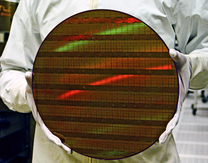

[comment]: # (THEME = league)
[comment]: # (CODE_THEME = base16/zenburn)
[comment]: # (controls: true)
[comment]: # (keyboard: true)
[comment]: # (markdown: { smartypants: true })
[comment]: # (hash: false)
[comment]: # (respondToHashChanges: false)
[comment]: # (slideNumber: true)


<style>
.reveal h1 { font-size: 2.5em; }
</style>
<style type="text/css">
    :root {
        --r-main-font-size: 32px;
    }
</style>
<style type="text/css">
.twocolumn {
   display: grid;
   grid-template-columns: 1fr 1fr;
   grid-gap: 10px;
   text-align: left;
}
</style>

[comment]: # (!!!)

## Slide aggiuntive (lezione extra)

[comment]: # (!!!)

## Blink

```python
import asyncio

led1 = Pin(36, Pin.OUT)
led2 = Pin(10, Pin.OUT)

async def blink_1():
    global led1
    while True:
        led1.value(not(led1.value()))
        await asyncio.sleep_ms(2000)

async def blink_2():
    global led2
    while True:
        led2.value(not(led2.value()))
        await asyncio.sleep_ms(1000)

def main():
    t1 = asyncio.create_task(blink_1)
    t2 = asyncio.create_task(blink_2)
    asyncio.gather(t1, t2)
```

Note:
- Obiettivo : dimostrare che le cose diventano difficili quando ci sono varie azioni da fare in parallelo.
- Se dovessi aggiungere 7 LED ?

[comment]: # (!!!)

## Asynchronous version

Aggiungiamo un conta secondi sul display

```python [5,19-25,30-31]
import asyncio

led1 = Pin(36, Pin.OUT)
led2 = Pin(10, Pin.OUT)
contatore = 0

async def blink_1():
    global led1
    while True:
        led1.value(not(led1.value()))
        await asyncio.sleep_ms(2000)

async def blink_2():
    global led2
    while True:
        led2.value(not(led2.value()))
        await asyncio.sleep_ms(1000)

async def conta():
    global contatore
    while True:
        contatore += 1
        display.text(str(contatore), 40, 12, 1)
        display.show()
        await asyncio.sleep_ms(1000)

def main():
    t1 = asyncio.create_task(blink_1)
    t2 = asyncio.create_task(blink_2)
    t3 = asyncio.create_task(conta)
    asyncio.gather(t1, t2, t3)
```

[comment]: # (!!!)

## Synchronous version

```python
contatore = 0
led1 = Pin(36, Pin.OUT)
led2 = Pin(10, Pin.OUT)

while True:
    led1.on()
    led2.off()
    contatore += 1
    display.text(str(contatore), 40, 12, 1)
    display.show()

    sleep(1)
    led1.on()
    led2.on()
    contatore += 1
    display.text(str(contatore), 40, 12, 1)
    display.show()

    sleep(1)
    led1.off()
    led2.off()
    contatore += 1
    display.text(str(contatore), 40, 12, 1)
    display.show()

    sleep(1)
    led1.off()
    led2.on()

    contatore += 1
    display.text(str(contatore), 40, 12, 1)
    display.show()
    sleep(1)
```
[comment]: # (!!!)

## Micropython: Sequenza di boot

Quando si accende il computer, parte il sistema operativo

Con Micropython al "power-on" o pulstane "reset"

- Esegue il file boot.py *non lo toccate*
- Esegue il file main.py *noi lavoremo qua*

Note:
- Nel file boot.py ho preparato gli import e le funzioni utili per il resto del corso

[comment]: # (!!!)

## Micropython 

Come programmare senza board collegata?

[WOKWI](https://wokwi.com/projects/305568836183130690)

Note:
- Quelli che hanno un computer e rete wifi si possono collegare a www.wokwi.com e selezionare "ESP32 with Micropython"

[comment]: # (!!!)

## Come provare senza essere connesso alla BOARD

[WOKWI ESP32](https://wokwi.com/projects/new/micropython-esp32)


Note:
- Serve connessione internet
- Possibile collegare vari componenti

[comment]: # (!!!)

## Premi ai gruppi scientifici più precisi

* Migliore precisione per la verifica esperimentale delle resistenze in parallelo ?

* Migliore precisione per la verifica esperimentale delle tensioni in un circuito ?

Vince chi ha l'errore più piccolo

$$ Errore = \lvert \frac{Misura - Teoria}{Teoria} \rvert $$

Note:
- Usare foglio excel a supporto e dati raccolti sui moduli
- Premio potrebbe essere un LED? Il pallone di elio?

[comment]: # (!!!)

## Librerie Python e Micropython

E' molto importante riusare codice già testato (librerie)

Micropython dà librerie utili

- Librerie machine [Link](https://docs.micropython.org/en/v1.20.0/library/machine.html)
- Librerie dispositivi (NeoPixel, Bluetooth...) [Link](https://docs.micropython.org/en/v1.20.0/library/neopixel.html)
- Librerie Python (random, time, ecc..) [Link](https://docs.micropython.org/en/v1.20.0/library/random.html)

[comment]: # (!!!)

## Giunzione P-N

L'ingrediente fondamentale del diodo, creata nel 1939


Note:
- Ci stiamo avvicinando pian piano ai nostri giorni
- Prima di usare un semiconduttore dobbiamo capire il principio fisico che lo rende possibile.
- Valutare come tagliare il video. E' interessante ma troppo lungo.

[comment]: # (!!!)

## Circuiti integrati

Tanti transistor messi assieme per uno scopo (memorizzare, fare operazioni logiche)

Economici da fabbricare in grandi quantità

- Fabbrichiamo migliari di migliardi di transistor ogni anno



Note:
- Esistono circuiti integrati per tutte le operazioni comuni in elettronica
- Esistono circuiti integrati che sono capaci di ricevere istruzioni da altri circuiti e di eseguirle
- Diventano così "microprocessori" o più semplicemente "processori"


[comment]: # (!!!)